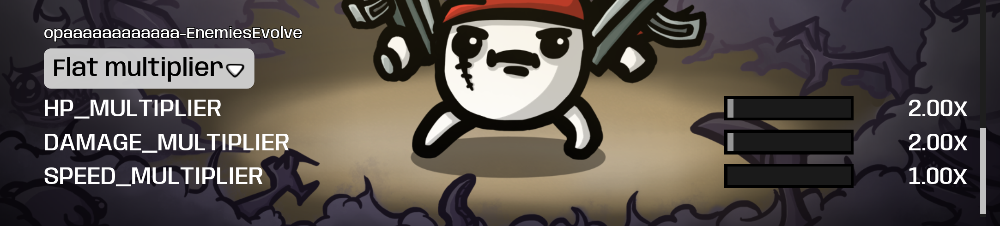
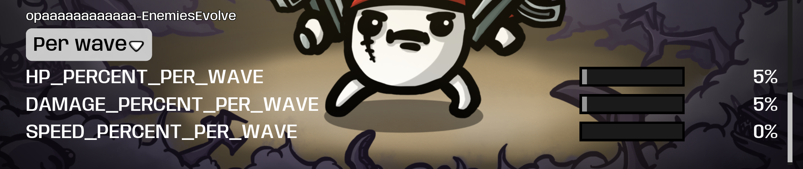

# EnemiesEvolve

Makes enemies STRONGER instead of MORE: buffs each enemy's stats instead of spawning extra enemies. Flat or per-wave scaling, configurable in-game.

## ✨ Features
- Per-wave mode (default): HP/damage/speed grow every wave, sliders 0-100% (5% default HP = 2x HP at wave 20)
- Flat mode: same boost the whole run — HP/damage 1x-20x, speed 1x-3x
- Applies to regular mobs, elites and bosses; stacks with Danger level and endless scaling
- Does not change spawn counts; settings saved and changeable mid-run (applies next wave)

## 📸 Screenshots

## 📦 Install
Subscribe on [Steam Workshop](https://steamcommunity.com/sharedfiles/filedetails/?id=3769878400) — Brotato installs it automatically. Requires Brotato 1.1+ and ModOptions (dami-ModOptions) for the sliders. Manual install: put the zip in the game's mods folder.

## 🔗 Links
- Mod page: https://steamcommunity.com/sharedfiles/filedetails/?id=3769878400
- All my mods: https://next.nexusmods.com/profile/opaaaaaaaaaaaa/mods
- Source & releases: https://github.com/nventatech/game-mods

## ☕ Support
If you like the mod: [PayPal](https://www.paypal.com/donate/?business=SR28XBBCYSPHE&no_recurring=0&item_name=Help+me+buy+a+coffee.&currency_code=USD)
