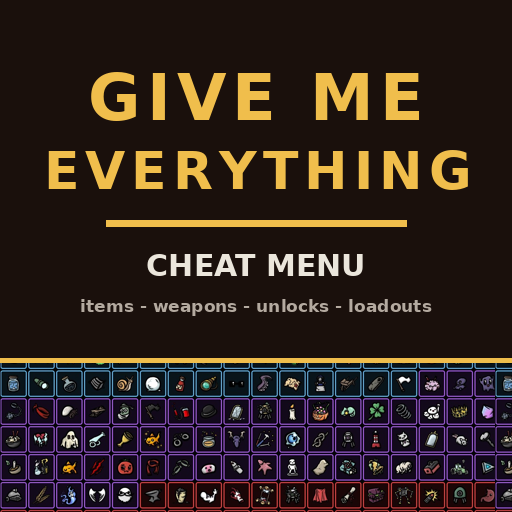
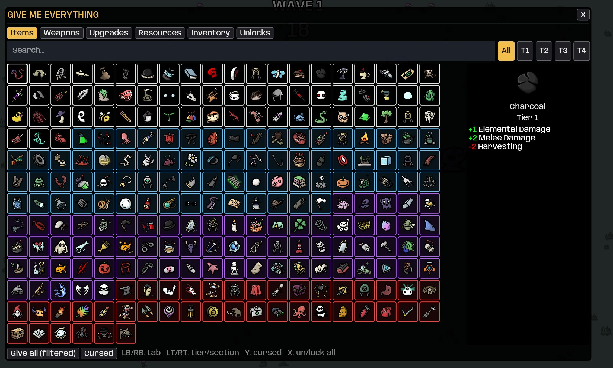
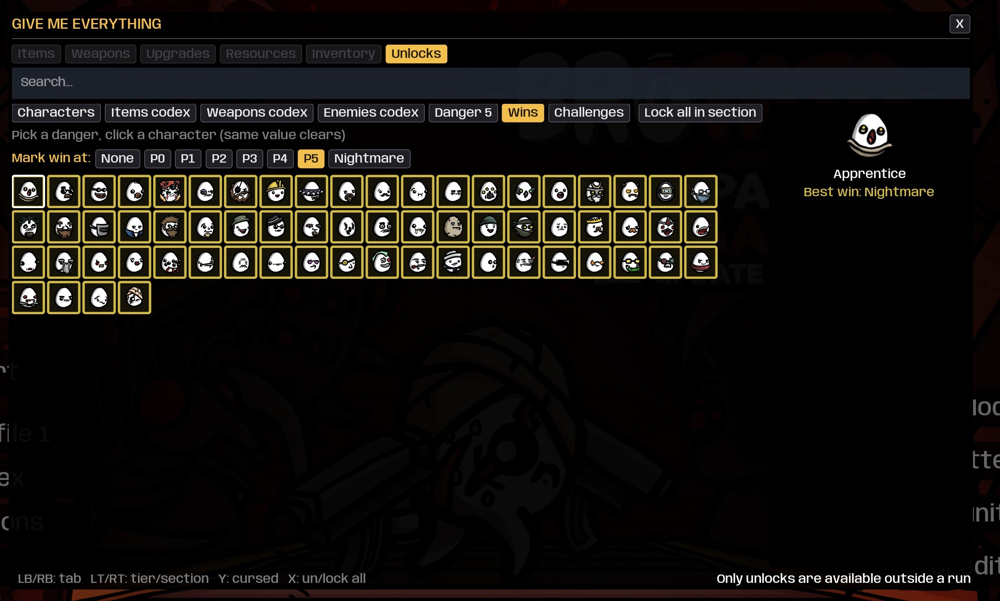

# GiveMeEverything

All-in-one cheat menu for Brotato: give any item, weapon or upgrade, edit gold/XP, god-mode cheats, spawn consumables, manage every unlock (characters, codex, challenges, danger, wins) and save loadouts. Full controller support, en/pt-BR.

## ✨ Features
- Give tabs with search, tier filter, icons and real in-game descriptions; DLC and modded content included automatically; cursed toggle with the DLC
- Gold/XP editing with infinite gold, invulnerability, one-shot enemies, instant waves, end wave, starting wave picker, consumable spawner
- Inventory tab with per-item removal and clear-all; named loadouts saved between runs
- Unlocks manager (works from the title screen): per-entry lock/unlock plus un/lock-all per section, and win painting up to Nightmare with the proper character select colors and border
- Controller: LB/RB tabs, LT/RT tiers/sections, Y cursed, X un/lock all; open with L3+R3
- Options in Options > Mods (requires ModOptions): open key, controller shortcut, pause on open, menu scale

## 📸 Screenshots

## 📦 Install
Subscribe on [Steam Workshop](https://steamcommunity.com/sharedfiles/filedetails/?id=3787782867) — Brotato installs it automatically. Requires Brotato 1.1+ (built-in mod support). Manual install: put the zip in the game's mods folder.

## 🔗 Links
- Mod page: https://steamcommunity.com/sharedfiles/filedetails/?id=3787782867
- All my mods: https://next.nexusmods.com/profile/opaaaaaaaaaaaa/mods
- Source & releases: https://github.com/nventatech/game-mods

## ☕ Support
If you like the mod: [PayPal](https://www.paypal.com/donate/?business=SR28XBBCYSPHE&no_recurring=0&item_name=Help+me+buy+a+coffee.&currency_code=USD)
