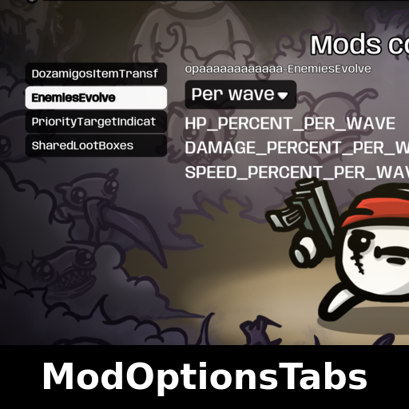
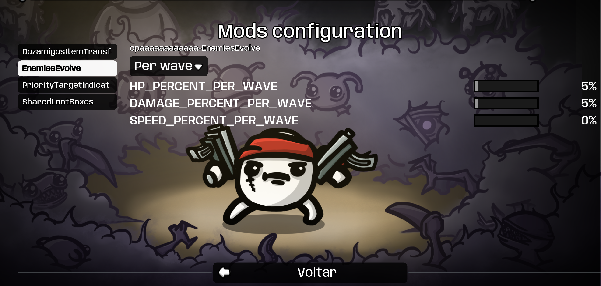

# ModOptionsTabs

Sidebar for the ModOptions menu: a list of mods on the left — click one, see only its settings. No more one giant stacked list.

## ✨ Features
- One button per configurable mod, sorted alphabetically
- Sidebar stays fixed while a mod's settings scroll; long mod lists scroll on their own
- Works in the title screen and pause menu
- Purely visual — settings, saving and other mods are untouched
- Fixes 16:9 cutoff; with fewer than 2 configurable mods the menu stays as it was

## 📸 Screenshots

## 📦 Install
Subscribe on [Steam Workshop](https://steamcommunity.com/sharedfiles/filedetails/?id=3769887447) — Brotato installs it automatically. Requires Brotato 1.1+ and ModOptions (dami-ModOptions). Manual install: put the zip in the game's mods folder.

## 🔗 Links
- Mod page: https://steamcommunity.com/sharedfiles/filedetails/?id=3769887447
- All my mods: https://next.nexusmods.com/profile/opaaaaaaaaaaaa/mods
- Source & releases: https://github.com/nventatech/game-mods

## ☕ Support
If you like the mod: [PayPal](https://www.paypal.com/donate/?business=SR28XBBCYSPHE&no_recurring=0&item_name=Help+me+buy+a+coffee.&currency_code=USD)
