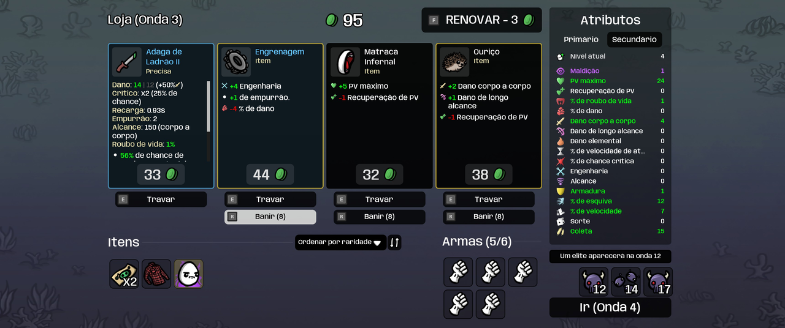

# ShopWishlist

Mark items in the shop and they get a colored border every time they show up — never skip past the item you're hunting while rerolling.

## ✨ Features
- Right-click (mouse) or R3 (controller) to mark/unmark a shop item
- Marked items get a colored border whenever they reappear; wishlist saved between runs
- Border color, controller button and clear-wishlist options in Options > Mods (requires ModOptions)
- Works in solo and co-op; lock, ban and steal still work as usual on marked items

## 📸 Screenshots

## 📦 Install
Subscribe on [Steam Workshop](https://steamcommunity.com/sharedfiles/filedetails/?id=3771061737) — Brotato installs it automatically. Requires Brotato 1.1+ (built-in mod support). Manual install: put the zip in the game's mods folder.

## 🔗 Links
- Mod page: https://steamcommunity.com/sharedfiles/filedetails/?id=3771061737
- All my mods: https://next.nexusmods.com/profile/opaaaaaaaaaaaa/mods
- Source & releases: https://github.com/nventatech/game-mods

## ☕ Support
If you like the mod: [PayPal](https://www.paypal.com/donate/?business=SR28XBBCYSPHE&no_recurring=0&item_name=Help+me+buy+a+coffee.&currency_code=USD)
