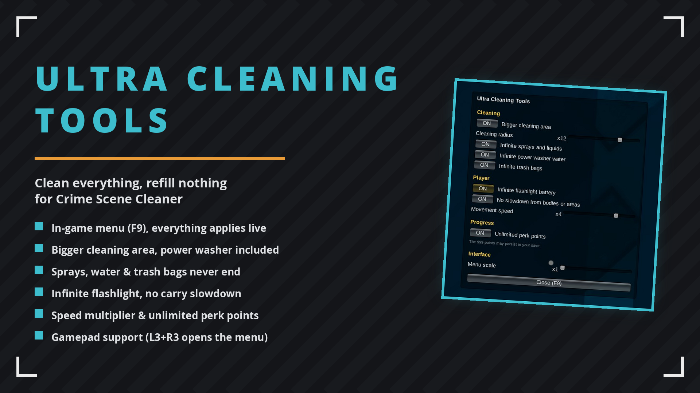

# Ultra Cleaning Tools

Bigger cleaning area, sprays and liquids never run out, infinite power washer water and infinite trash bag capacity. One menu for everything: F9 or L3+R3 on a gamepad.

## ✨ Features
- In-game menu on F9, draggable and scalable
- Full gamepad control (see Controls below)
- Bigger cleaning area
- Sprays & liquids never run out
- Infinite washer water - backpack too
- Infinite trash bag capacity
- Movement speed multiplier
- Unlimited perk points

## 🎮 Controls
| Input | Action |
| --- | --- |
| F9 / L3+R3 | open and close the menu |
| Left stick or arrows | move between options |
| A | select |
| B / Esc | close |
| Left / right | adjust sliders |

Your character stays put while the menu is open.

## 🌍 Translating
Texts live in `I18n.cs`, one dictionary per language keyed by the English string. To add a
language, copy the dictionary, translate the values and return it from `PickTable`.

## 📦 Install
Download on [Nexus Mods](https://www.nexusmods.com/crimescenecleaner/mods/10). Extract into the game folder - the DLL lands in `Mods/`. Requires MelonLoader.

## 🔗 Links
- Mod page: https://www.nexusmods.com/crimescenecleaner/mods/10
- All my mods: https://next.nexusmods.com/profile/opaaaaaaaaaaaa/mods
- Source & releases: https://github.com/nventatech/game-mods

## ☕ Support
If you like the mod: [PayPal](https://www.paypal.com/donate/?business=SR28XBBCYSPHE&no_recurring=0&item_name=Help+me+buy+a+coffee.&currency_code=USD)
