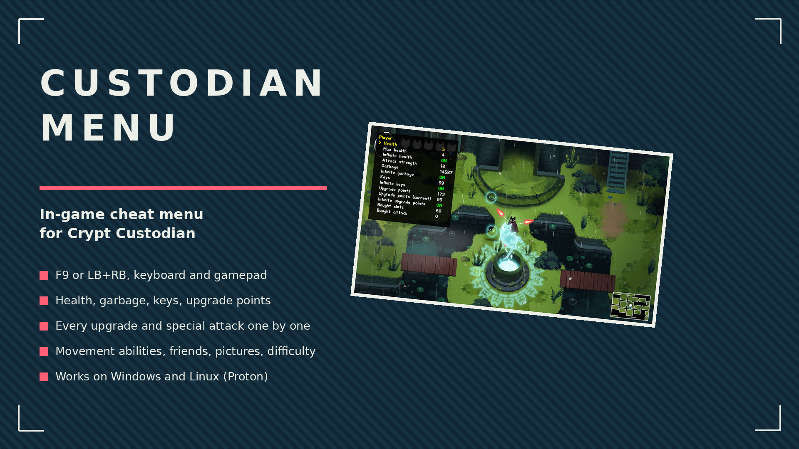
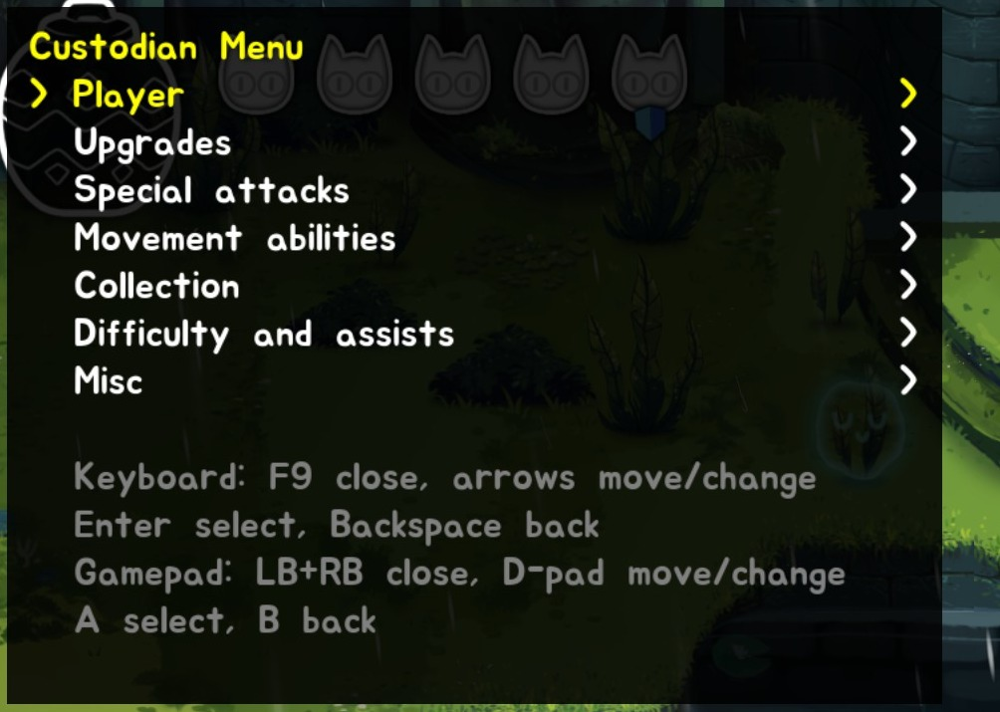
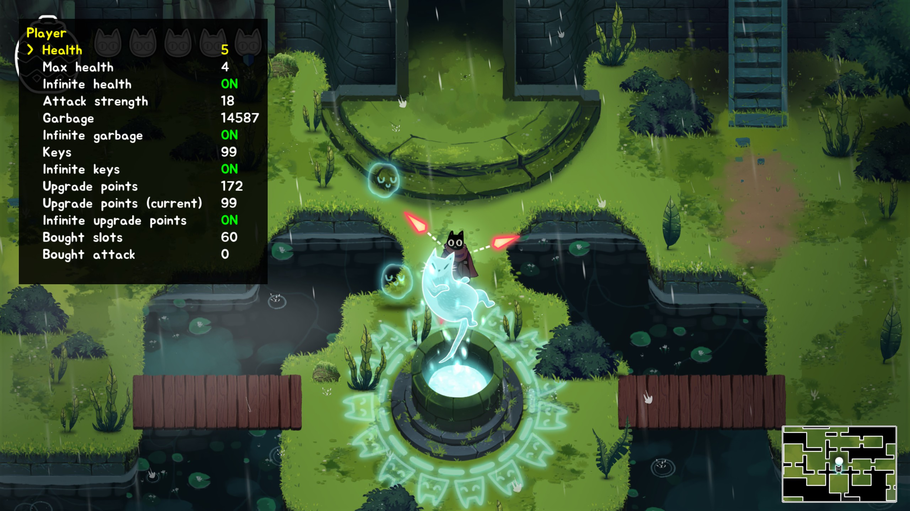
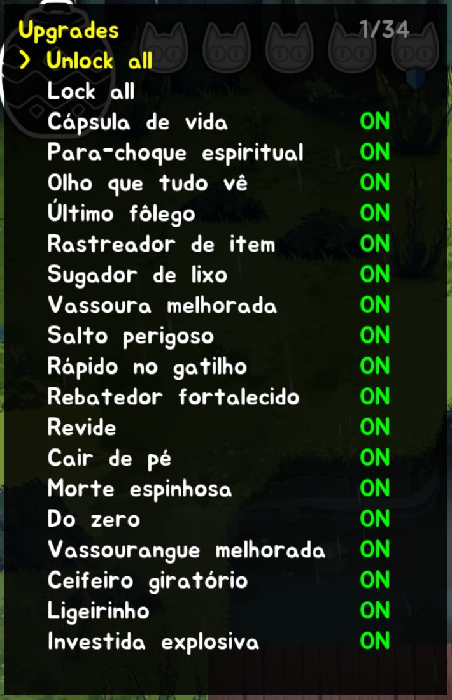
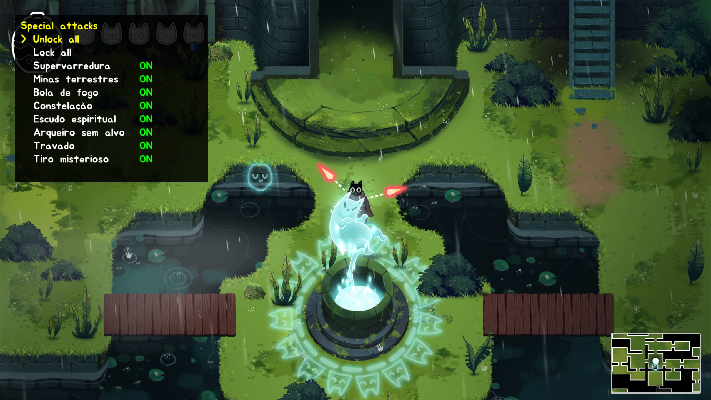
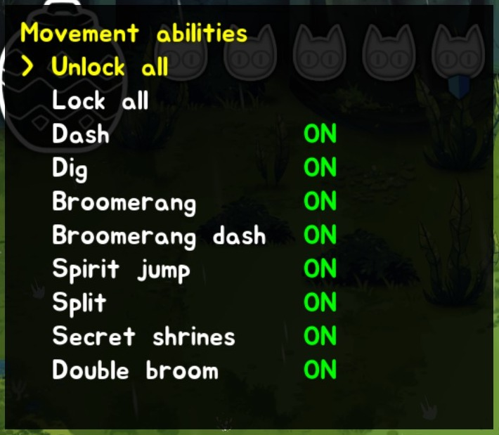
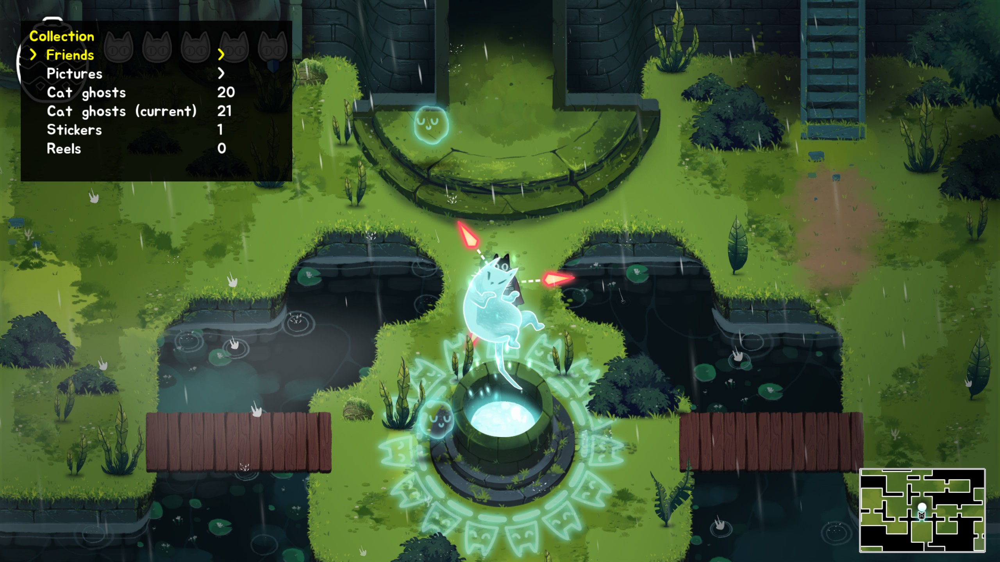
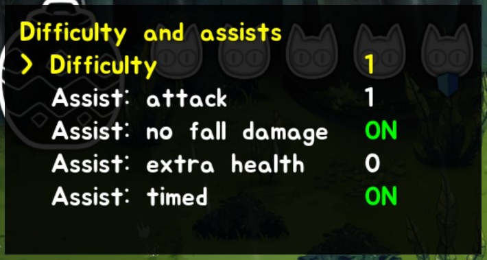
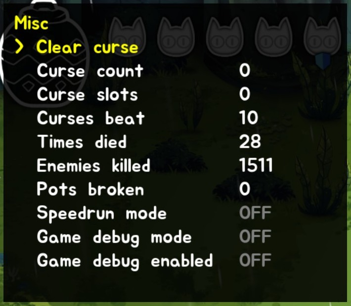

# Custodian Menu

In-game cheat menu for Crypt Custodian. Press F9 (or LB+RB on a gamepad), change what you want, close it and keep playing.

## ✨ Features
- Menu on F9 or LB+RB, keyboard and gamepad, values update live
- Health, max health, attack strength, garbage, keys and upgrade points, each with its own infinite switch where it makes sense
- Every upgrade and special attack listed by the game's own name, one switch each, plus unlock all / lock all
- Movement abilities (dash, dig, broomerang, spirit jump, split, secret shrines) one by one
- Friends, pictures, cat ghosts, stickers and reels
- Difficulty and every assist option
- Clear the current curse, edit run stats, toggle the game's own debug flags
- Follows the game's language (English or Portuguese), with an in-menu override
- Infinite switches and language persist in `CustodianMenu.ini` next to the game

## 🎮 Controls
| Input | Action |
| --- | --- |
| F9 / LB+RB | open and close the menu |
| Arrows, D-pad or left stick | move, change values |
| Enter / A | select |
| Backspace, Esc / B | back, then close |

While the menu is open the game ignores its own controls, so the cat stays put.

## 📸 Screenshots

## 🌍 Translating
Strings live in `I18n.cpp`, one table keyed by the English text. To add a language, copy the Portuguese table, translate the values and add a mode for it.

## 📦 Install
Download the zip from the badge above (Nexus page coming once the game is approved there). Requires [Aurie](https://github.com/AurieFramework/Aurie) and [YYToolkit](https://github.com/AurieFramework/YYToolkit).

Windows: run the Aurie installer on `CryptCustodian.exe`, then extract the zip into the game folder. The DLLs land in `mods/aurie/`.

Linux (Proton): the zip includes `AurieWineShim.dll`, which fixes Aurie's module init under Wine. Put `AurieCore.dll` in `mods/native/`, `YYToolkit.dll` in `mods/aurie/`, patch the exe once with `AuriePatcher.exe` through the game's Proton prefix, then extract the zip. Launch through Steam as usual.

## 🔗 Links
- All my mods: https://next.nexusmods.com/profile/opaaaaaaaaaaaa/mods
- Source & releases: https://github.com/nventatech/game-mods

## ☕ Support
If you like the mod: [PayPal](https://www.paypal.com/donate/?business=SR28XBBCYSPHE&no_recurring=0&item_name=Help+me+buy+a+coffee.&currency_code=USD)
