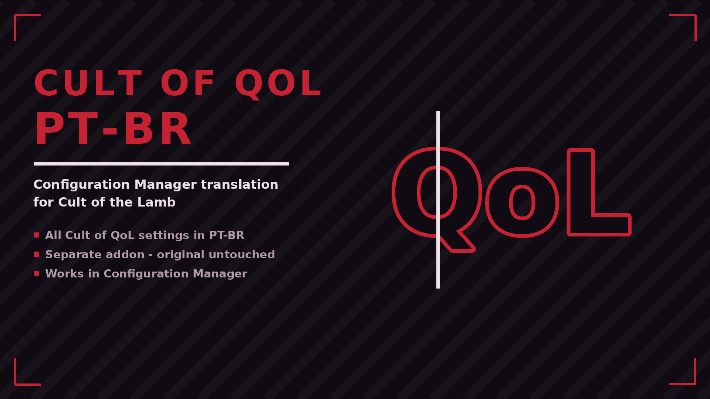

# Cult of QoL PT-BR

Translates every Cult of QoL Collection option shown in the Configuration Manager window to Brazilian Portuguese (traduz para PT-BR as opções do Cult of QoL Collection no Configuration Manager). Standalone addon - does not modify the original mod.

## ✨ Features
- All Cult of QoL settings in PT-BR
- Separate addon - original untouched
- Works in Configuration Manager

## 📦 Install
Download on [Nexus Mods](https://www.nexusmods.com/cultofthelamb/mods/84). Extract into the game folder - the DLL lands in `BepInEx/plugins/`. Requires BepInEx 5.

## 🔗 Links
- Mod page: https://www.nexusmods.com/cultofthelamb/mods/84
- All my mods: https://next.nexusmods.com/profile/opaaaaaaaaaaaa/mods
- Source & releases: https://github.com/nventatech/game-mods

## ☕ Support
If you like the mod: [PayPal](https://www.paypal.com/donate/?business=SR28XBBCYSPHE&no_recurring=0&item_name=Help+me+buy+a+coffee.&currency_code=USD)
