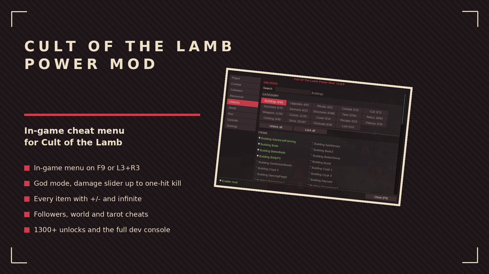
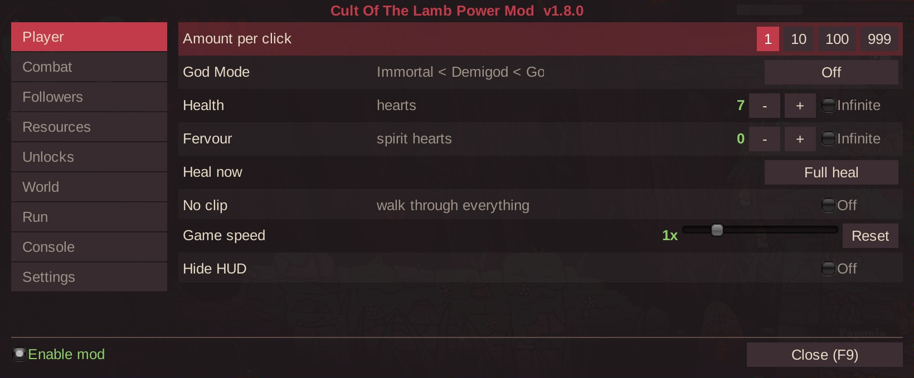
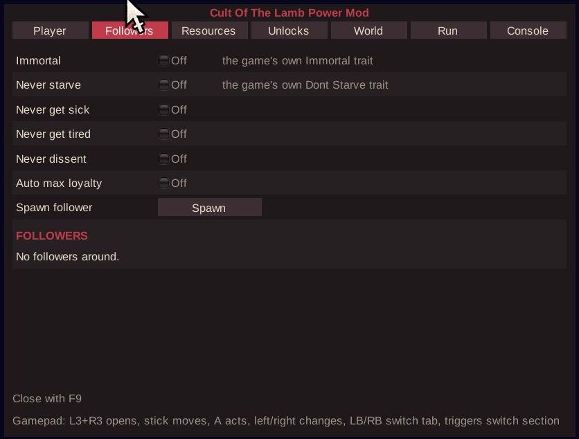
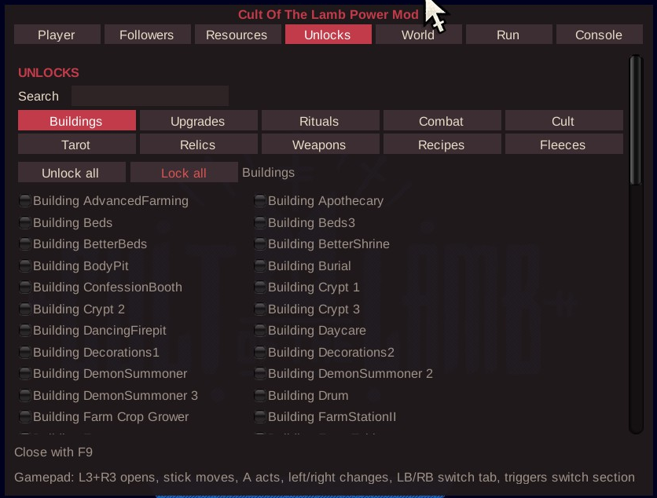
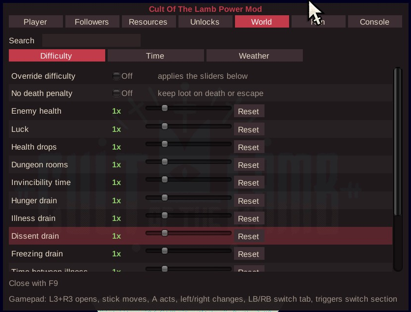
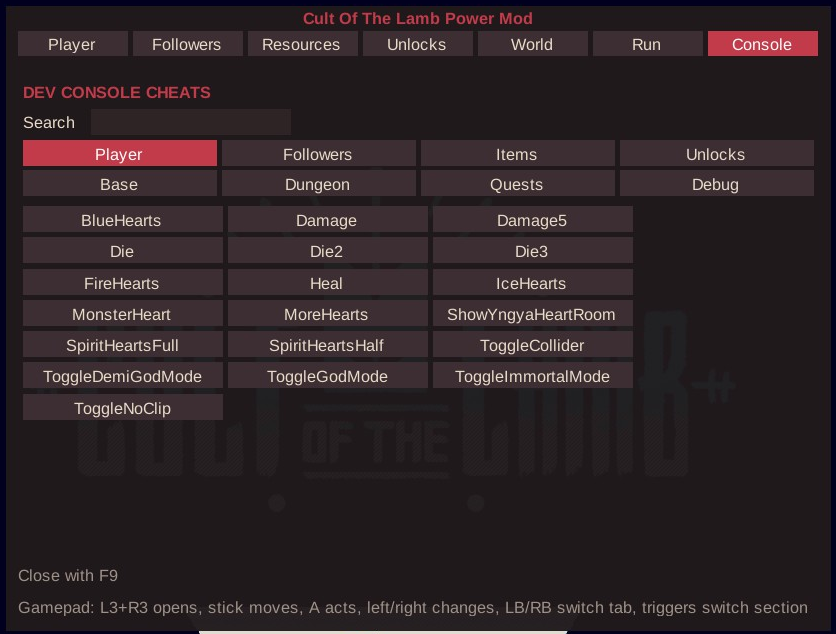

# Cult Of The Lamb Power Mod

In-game cheat menu for Cult of the Lamb. Press F9 (or L3+R3 on a gamepad), toggle what you want, no restart and no other plugin needed.

## ✨ Features
- In-game menu on F9, everything live
- Full gamepad control, no mouse needed (see Controls below)
- God mode, one-hit kill, damage multiplier, no clip, game speed, hide HUD
- Menu scale slider - readable on 1440p, ultrawide and 4K (default picked from your screen)
- Every item in the game with +/-, remove and infinite - DLC items included (Woolhaven section, everything else under Other)
- Cult faith: raise, lower, keep maxed, stop the drain, clear negative thoughts
- Follower cards with live portrait: traits, rename, spawn, loyalty, heal, rejuvenate, cure dissent, free prisoners
- World: difficulty sliders (enemy health, luck, hunger, illness and more), no death penalty, pause/skip the day cycle, weather control, no ritual cooldown
- Run: every tarot card as a toggle, card set saved and auto-given every run, relic always charged, instant fishing, lucky dice
- 1300+ unlocks in 19 categories (buildings, upgrades, rituals, doctrines, sermons, structures, tarot, relics, weapons, curses, crown, recipes, fleeces, clothing, follower forms, flockade, lore) with counters, search, unlock all and re-lock - mobile-exclusive outfits and decorations included
- Full dev console: 90+ of the game's own cheats as buttons, by category
- English and Brazilian Portuguese, following the game language

## 🎮 Controls
| Input | Action |
| --- | --- |
| F9 / L3+R3 | open and close the menu |
| Stick, d-pad or arrows | move between rows |
| A | act on the highlighted row |
| B | close |
| Left / right | change the value (resources, sliders, cycles) |
| LB / RB | change tab |
| Triggers | change section inside a tab |

## 📸 Screenshots

## 🌍 Translating
Texts live in `I18n.cs`, one dictionary per language keyed by the English string. To add a
language, copy the dictionary, translate the values and return it from `PickTable`.

## 📦 Install
Download on [Nexus Mods](https://www.nexusmods.com/games/cultofthelamb/mods/114). Extract into the game folder - the DLL lands in `BepInEx/plugins/`. Requires BepInEx 5.

## 🔗 Links
- Mod page: https://www.nexusmods.com/games/cultofthelamb/mods/114
- All my mods: https://next.nexusmods.com/profile/opaaaaaaaaaaaa/mods
- Source & releases: https://github.com/nventatech/game-mods

## ☕ Support
If you like the mod: [PayPal](https://www.paypal.com/donate/?business=SR28XBBCYSPHE&no_recurring=0&item_name=Help+me+buy+a+coffee.&currency_code=USD)
