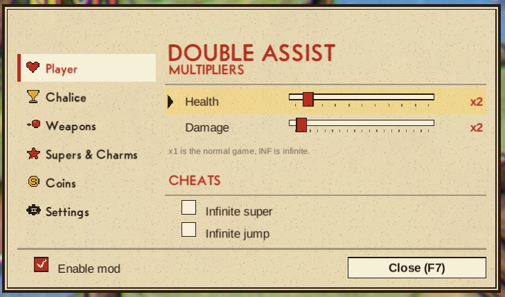
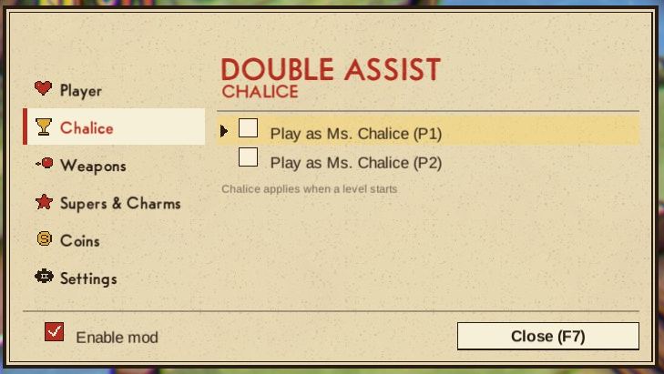
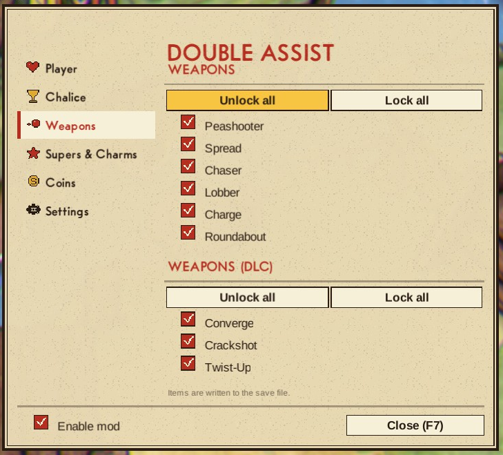
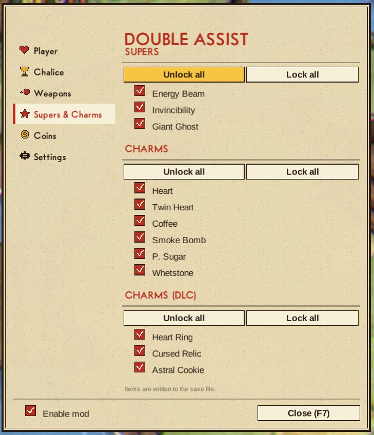
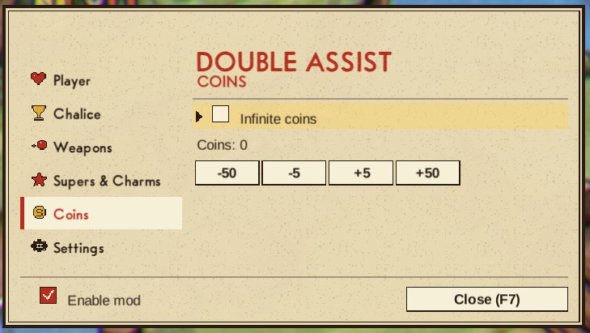
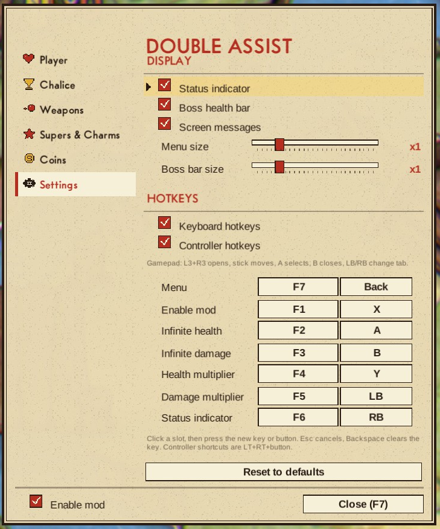
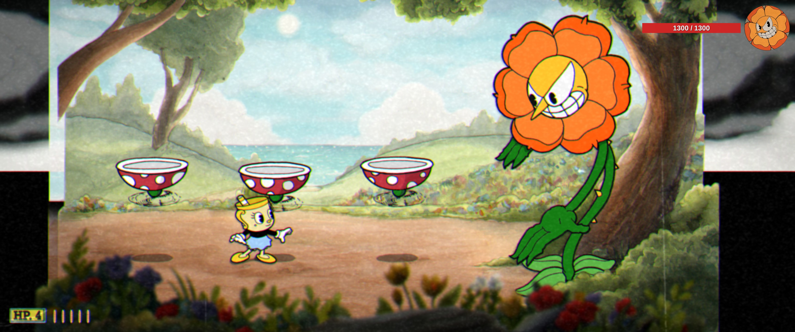

# Cuphead Double Assist

Multiplies your damage and health (x1 to x10, or infinite). In-game menu on F7 or L3+R3 on a gamepad.

## ✨ Features
- Tabbed menu: Player, Chalice, Weapons, Supers & Charms, Coins, Settings
- Full gamepad control, no mouse needed (see Controls below)
- One slider per stat: x1 is the normal game, x2 to x10, INF at the end
- Infinite super, jump and coins
- Play as Ms. Chalice per player (DLC)
- Every weapon, super and charm by its shop name in the game's language, unlock and lock back
- Boss health bar with the boss portrait, updates as you hit
- Menu and boss bar scale with the screen, with size sliders
- Rebind every hotkey and controller shortcut in the Settings tab, reset to defaults
- Live config reload

## 🎮 Controls
| Input | Action |
| --- | --- |
| F7 / L3+R3 | open and close the menu |
| Stick or d-pad | move between options |
| A | select |
| B | close |
| Left / right | adjust the multipliers |
| LB / RB | change tab |

Your character stays put while the menu is open.

## 📸 Screenshots

## 🌍 Translating
Texts live in `I18n.cs`, one dictionary per language keyed by the English string. To add a
language, copy the dictionary, translate the values and return it from `PickTable`.

## 📦 Install
Download on [Nexus Mods](https://www.nexusmods.com/cuphead/mods/115). Extract into the game folder - the DLL lands in `BepInEx/plugins/`. Requires BepInEx 5.

## 🔗 Links
- Mod page: https://www.nexusmods.com/cuphead/mods/115
- All my mods: https://next.nexusmods.com/profile/opaaaaaaaaaaaa/mods
- Source & releases: https://github.com/nventatech/game-mods

## ☕ Support
If you like the mod: [PayPal](https://www.paypal.com/donate/?business=SR28XBBCYSPHE&no_recurring=0&item_name=Help+me+buy+a+coffee.&currency_code=USD)
