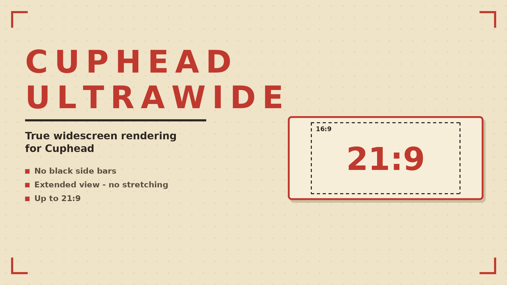

# Cuphead UltraWide

Removes the black side bars and renders the game at your monitor's aspect ratio, up to 21:9. No stretching.

## ✨ Features
- No black side bars
- Extended view - no stretching
- Up to 21:9

## 📦 Install
Download on [Nexus Mods](https://www.nexusmods.com/cuphead/mods/122). Extract into the game folder - the DLL lands in `BepInEx/plugins/`. Requires BepInEx 5.

## 🔗 Links
- Mod page: https://www.nexusmods.com/cuphead/mods/122
- All my mods: https://next.nexusmods.com/profile/opaaaaaaaaaaaa/mods
- Source & releases: https://github.com/nventatech/game-mods

## ☕ Support
If you like the mod: [PayPal](https://www.paypal.com/donate/?business=SR28XBBCYSPHE&no_recurring=0&item_name=Help+me+buy+a+coffee.&currency_code=USD)
