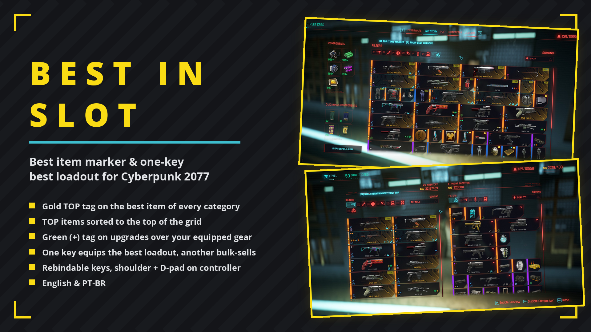
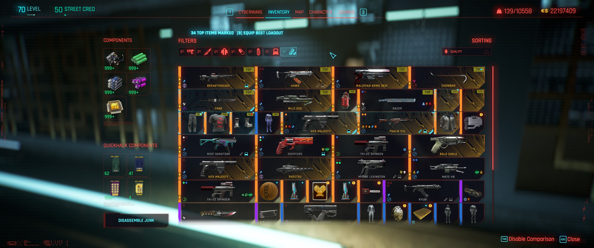
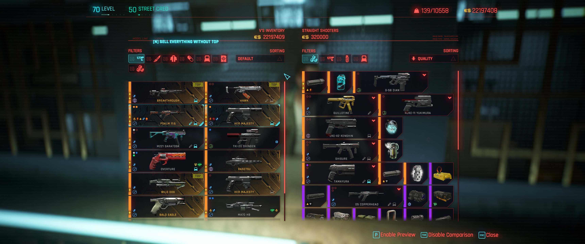
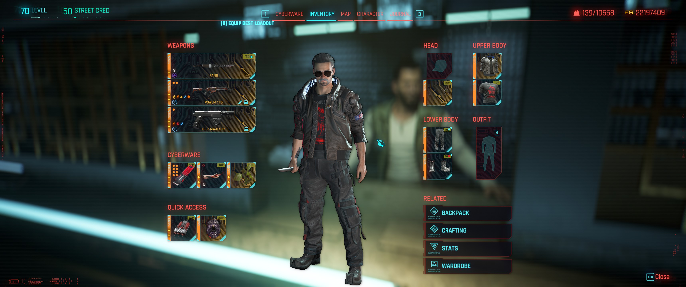
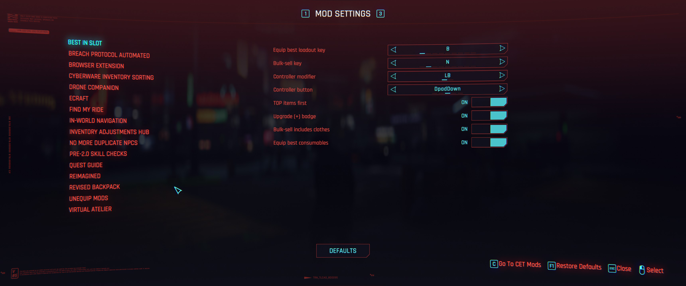

# BestInSlot

Gold TOP tag on the best item of every category across all item screens, sorted to the top of the grid. One key equips the best loadout, another bulk-sells everything without the tag.

## ✨ Features
- Gold TOP tag on every best item
- Green (+) tag on items better than what you have equipped
- TOP items sorted to the top of the grid
- B in the backpack or inventory - equip best loadout
- N at vendors - sell non-TOP weapons and clothes
- Controller: shoulder + D-pad does the same
- Rebindable keys and options in the Mod Settings menu (optional dependency)
- English & PT-BR, following the game language

## 📸 Screenshots

## 🌍 Translating
Texts live in `Localization.reds`. To add a language, copy a package class, translate the
strings and add a `case` in `GetPackage`. A translation can also ship as a separate mod:
register your own `ModLocalizationProvider` with the same keys.

## 📦 Install
Download on [Nexus Mods](https://www.nexusmods.com/cyberpunk2077/mods/31702). Extract into the game root folder (the one with `bin`, `archive`, `r6`) or install with Vortex / Mod Organizer 2.

## 🔗 Links
- Mod page: https://www.nexusmods.com/cyberpunk2077/mods/31702
- All my mods: https://next.nexusmods.com/profile/opaaaaaaaaaaaa/mods
- Source & releases: https://github.com/nventatech/game-mods

## ☕ Support
If you like the mod: [PayPal](https://www.paypal.com/donate/?business=SR28XBBCYSPHE&no_recurring=0&item_name=Help+me+buy+a+coffee.&currency_code=USD)
