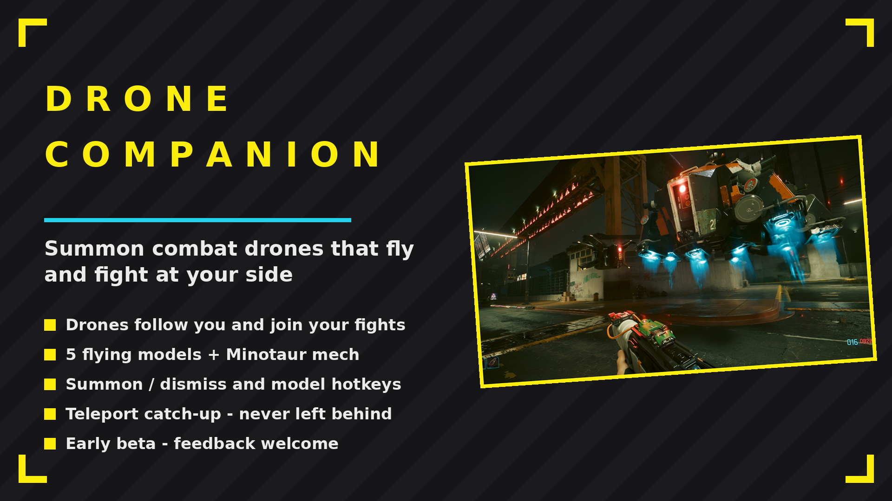
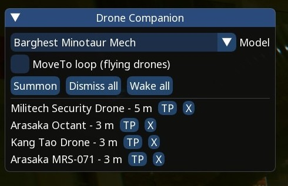

# Drone Companion

Summon combat drones that follow you around Night City and fight at your side. Early beta.

## ✨ Features
- Six models: Militech Security Drone, Arasaka Octant, Kang Tao Drone, FSS Griffin, Arasaka MRS-071 and the Barghest Minotaur mech
- Drones share your side and engage whoever attacks you
- Follow with teleport catch-up - never left behind
- Summon/dismiss and model-cycle hotkeys (bound in CET Bindings)
- Overlay manager window: multiple drones, individual dismiss, teleport-to-me

## 📸 Screenshots

## 📦 Install
Download on Nexus Mods. Extract into the game root folder (the one with `bin`, `archive`, `r6`) or install with Vortex / Mod Organizer 2. Requires Cyber Engine Tweaks and Codeware.

## 🔗 Links
- All my mods: https://next.nexusmods.com/profile/opaaaaaaaaaaaa/mods
- Source & releases: https://github.com/nventatech/game-mods

## ☕ Support
If you like the mod: [PayPal](https://www.paypal.com/donate/?business=SR28XBBCYSPHE&no_recurring=0&item_name=Help+me+buy+a+coffee.&currency_code=USD)
