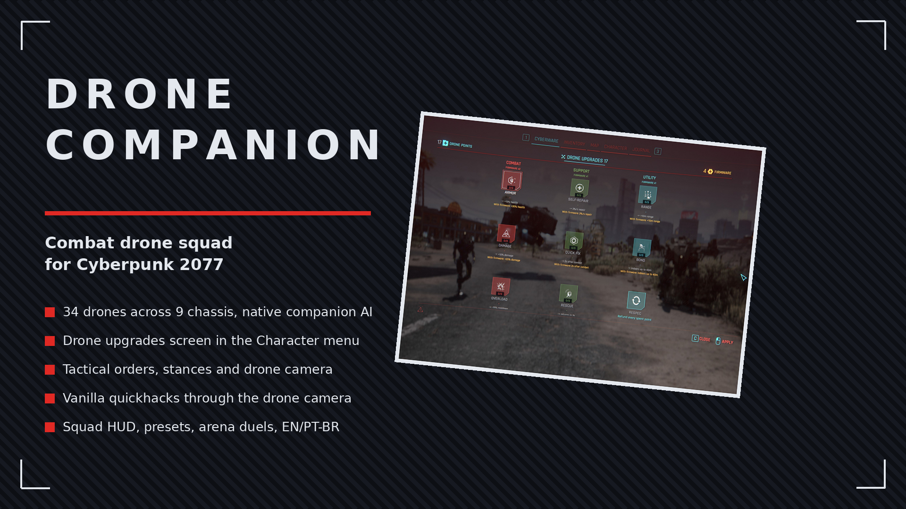
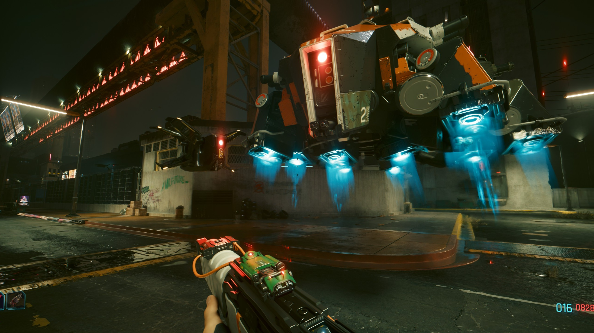
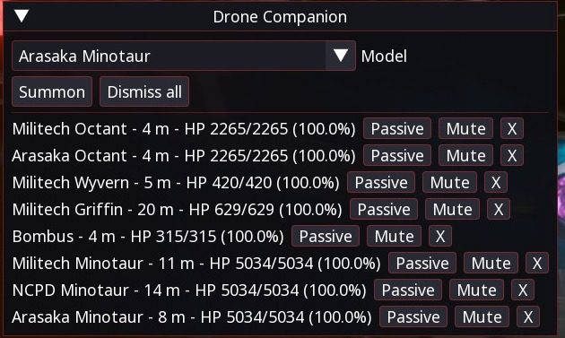

# Drone Companion

Summon combat drones that follow you around Night City and fight at your side. Beta.

## ✨ Features
- Eight models: Militech and Arasaka Octants, Wyvern, Griffin, Bombus, and three Minotaur mechs (Militech, NCPD, Arasaka)
- Native companion AI: real follow, teleport catch-up, rejoin after combat
- No friendly fire; enemies target drones, police never turn them hostile
- Out-of-combat self-repair with HP readout in the manager window
- Per-drone mute for hover, beeps and engine sounds
- Drones persist through saves, fast travel, vehicles and cutscenes
- Summon/dismiss and model-cycle hotkeys (bound in CET Bindings)
- English and Portuguese, following the game language

## 📸 Screenshots

## 📦 Install
Download on [Nexus Mods](https://www.nexusmods.com/cyberpunk2077/mods/32572). Extract into the game root folder (the one with `bin`, `archive`, `r6`) or install with Vortex / Mod Organizer 2. Requires Cyber Engine Tweaks, RED4ext, redscript and Codeware.

## 🔗 Links
- Mod page: https://www.nexusmods.com/cyberpunk2077/mods/32572
- All my mods: https://next.nexusmods.com/profile/opaaaaaaaaaaaa/mods
- Source & releases: https://github.com/nventatech/game-mods

## ☕ Support
If you like the mod: [PayPal](https://www.paypal.com/donate/?business=SR28XBBCYSPHE&no_recurring=0&item_name=Help+me+buy+a+coffee.&currency_code=USD)
