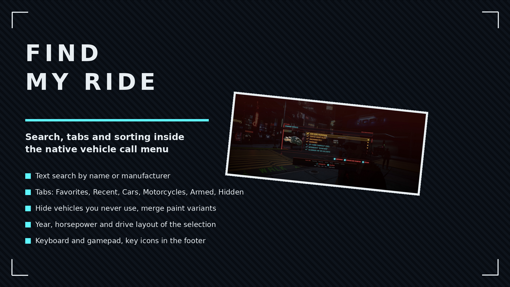
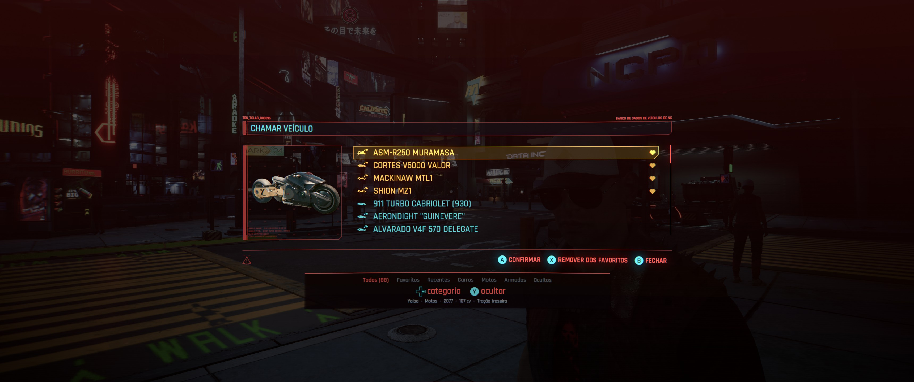
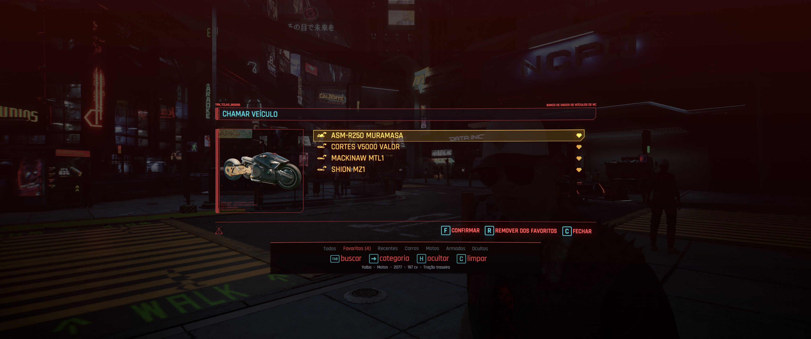
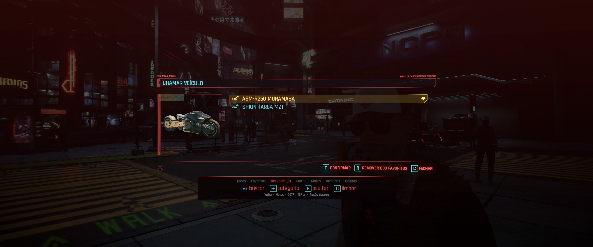
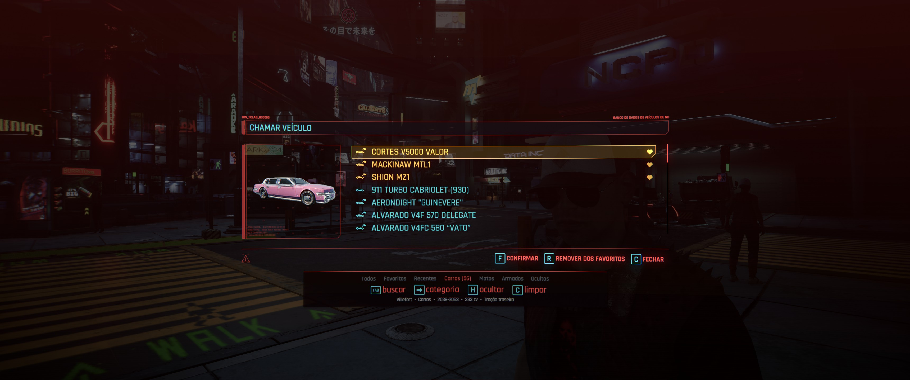
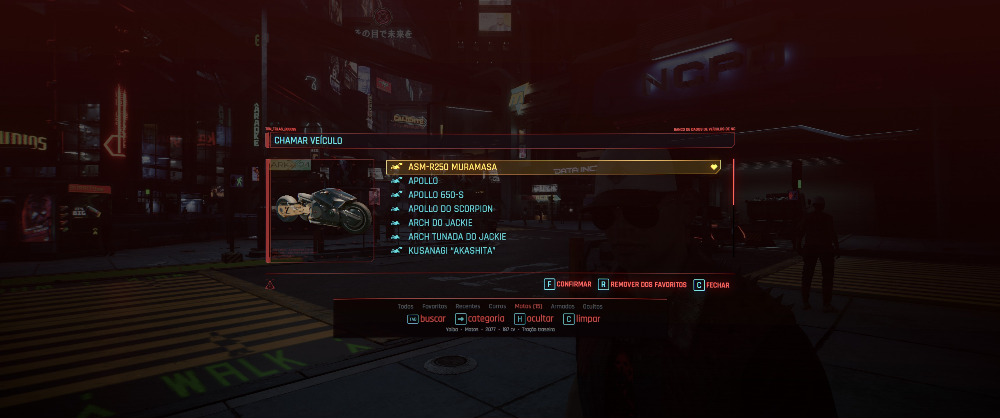
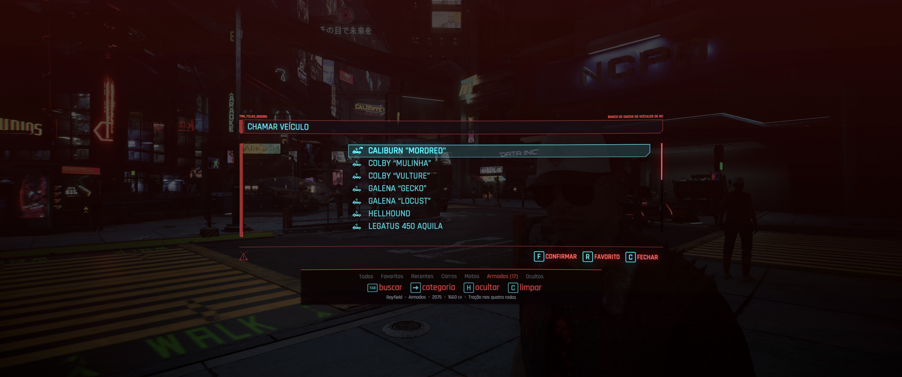
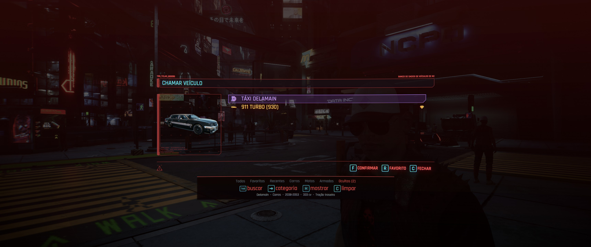
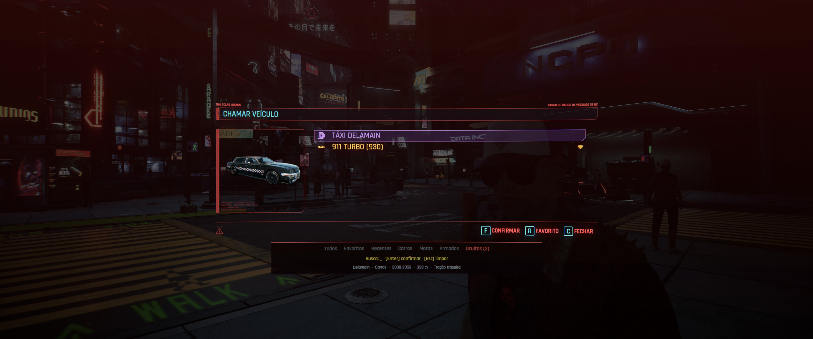
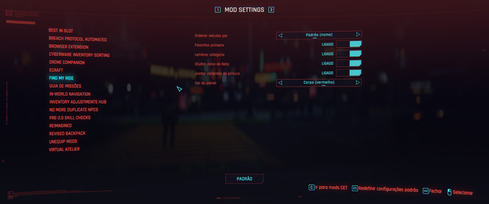

# FindMyRide

Text search, category tabs and sorting inside the native vehicle call menu (hold V). No extra windows.

## ✨ Features
- Text search in the vehicle call menu, by name or manufacturer
- Category tabs: All / Favorites / Recent / Cars / Motorcycles / Armed, last one remembered
- Recent tab lists the last 10 vehicles you summoned
- Hide vehicles you never use with H (Y on gamepad); they move to a Hidden tab
- Gamepad: D-pad or LB/RB cycle tabs; footer shows real key/button icons
- Sort by name, manufacturer or vehicle type; favorites-first toggle
- Manufacturer, type, year, horsepower and drive layout of the selected vehicle
- Same-name paint variants merged into one entry (can be turned off)
- Panel color: cyan, yellow or red
- Hides the vanilla "still in Beta" disclaimer
- Native UI - no extra windows
- Options in the Mod Settings menu (optional dependency)
- English & PT-BR, following the game language

## 📸 Screenshots

## 🌍 Translating
Texts live in `Localization.reds`. To add a language, copy a package class, translate the
strings and add a `case` in `GetPackage`. A translation can also ship as a separate mod:
register your own `ModLocalizationProvider` with the same keys.

## 📦 Install
Download on [Nexus Mods](https://www.nexusmods.com/cyberpunk2077/mods/31610). Extract into the game root folder (the one with `bin`, `archive`, `r6`) or install with Vortex / Mod Organizer 2.

## 🔗 Links
- Mod page: https://www.nexusmods.com/cyberpunk2077/mods/31610
- All my mods: https://next.nexusmods.com/profile/opaaaaaaaaaaaa/mods
- Source & releases: https://github.com/nventatech/game-mods

## ☕ Support
If you like the mod: [PayPal](https://www.paypal.com/donate/?business=SR28XBBCYSPHE&no_recurring=0&item_name=Help+me+buy+a+coffee.&currency_code=USD)
