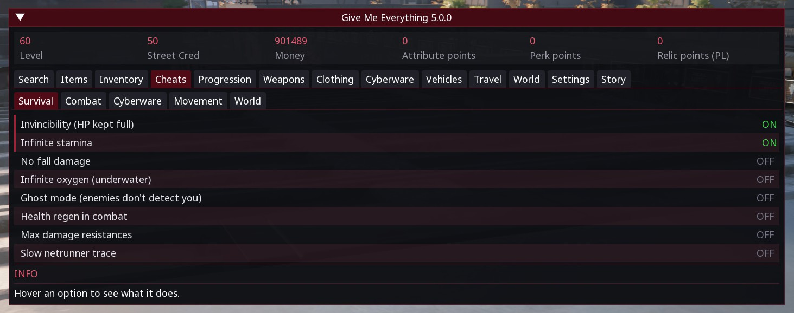
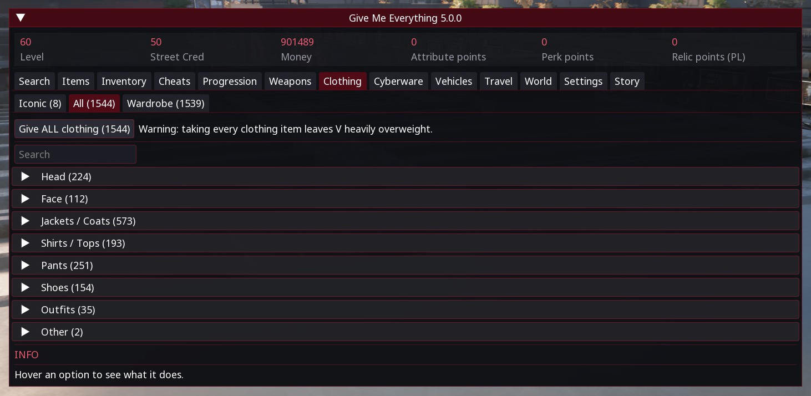
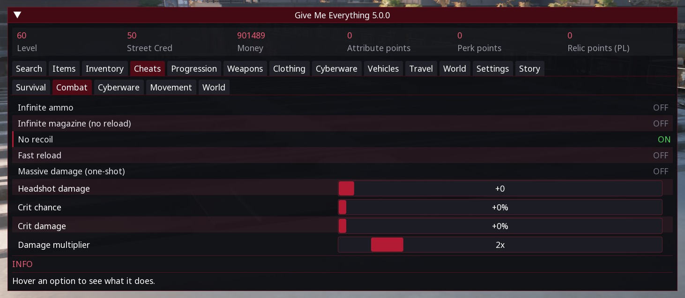
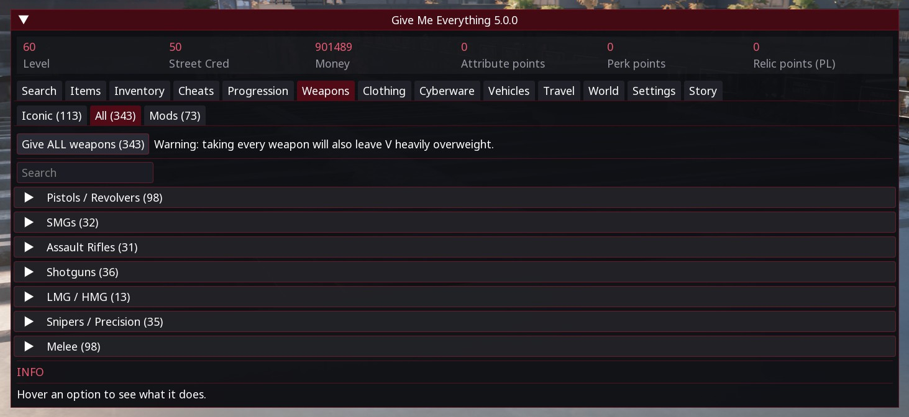
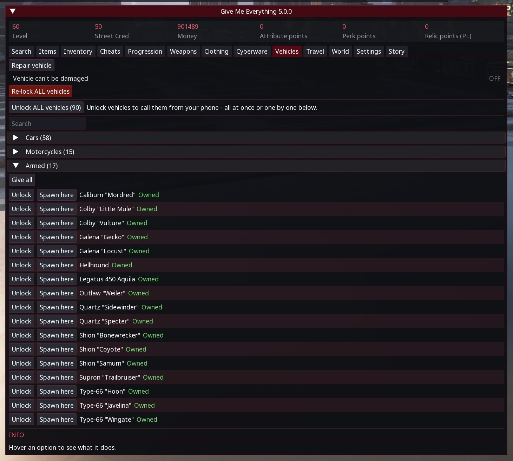
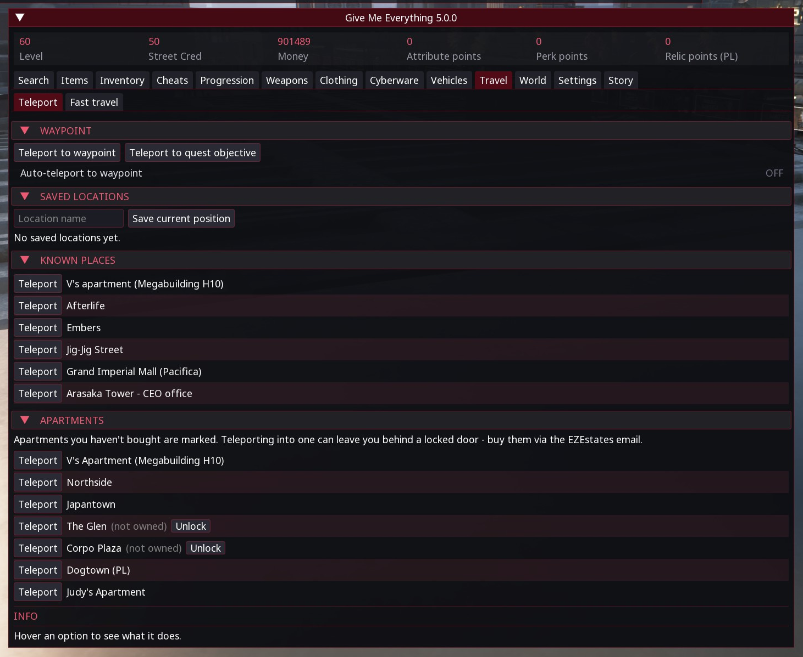
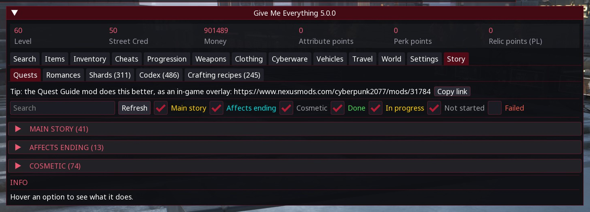

# GiveMeEverything

All-in-one cheat panel for CET: any item at any rarity, god mode, multipliers, teleport, fast travel, vehicles, quest journal and more.

## ✨ Features
- Controller menu drawn by the mod (RB+Y or F7), keyboard works too, same tabs
- Info panel that explains every option, nine color themes, settings backup and restore
- Any item, any rarity - 15 tabs with sub-tabs and item counts
- Modded sub-tab in Clothes, Weapons, Cyberware and Vehicles: only items from other mods, grouped by mod; wardrobe can register modded pieces only; search has a mods-only toggle
- Option search across every tab, right-click to pin rows, Active tab, tab bar left or top, hide unused tabs, compact mode
- Combat test: spawn a squad of any faction in front of you to try a build
- Aim assist (hold, toggle, ADS, while shooting or always), NPC ESP through walls, stat lock
- Noclip, kill hostiles nearby, hide HUD, FOV, attributes -/+, perks one by one
- Weapon mods on the gun in hand: accuracy, range, zoom, pierce, smart lock, melee beast, psycho
- Bullet time, status effects, Breach Protocol options, base stats, sell or disassemble in Cleanup
- Loot filter: block junk by category and tier, up to 5++
- Auto-loot: empty bodies and containers from a distance, markers included - all the time, on the interact key or only on your own CET keybind
- Checklists: every perk shard and set clothing piece with teleport, map pin and directions; origin of every iconic weapon
- Vehicle light colour and brightness, rainbow lights, infinite missiles, instant enter
- God mode, XP/damage multipliers, cyberware duration and slow-mo sliders, quickhack/run speed/crafting tweaks, extra cyberware capacity, unlocks
- Teleport to waypoint, saved spot or quest objective, fast travel, spawn any vehicle in front of you
- Clock speed, day skip, weather freeze, wanted level hold, easy arcades
- Stuck save rescue: unlock fast travel and saving, clear movement restrictions, reset the camera
- Live quest journal with one-click track
- Items from other mods are protected from cleanup and loot filter
- 8 languages: EN, PT-BR, ES, FR, DE, RU, ZH-CN, PL (RU and ZH need a CET font setting, the mod shows how)

## 📸 Screenshots

## 📦 Install
Download on [Nexus Mods](https://www.nexusmods.com/cyberpunk2077/mods/31460). Extract into the game root folder (the one with `bin`, `archive`, `r6`) or install with Vortex / Mod Organizer 2.

Requires [Cyber Engine Tweaks](https://www.nexusmods.com/cyberpunk2077/mods/107) and [Codeware](https://www.nexusmods.com/cyberpunk2077/mods/7780) (which brings RED4ext and redscript). [TweakXL](https://www.nexusmods.com/cyberpunk2077/mods/4197) is only needed by the cyberware capacity slider and the optional Level Cap 100 file. The zip has `bin/` and `r6/` folders; copy both.

## 🔗 Links
- Mod page: https://www.nexusmods.com/cyberpunk2077/mods/31460
- All my mods: https://next.nexusmods.com/profile/opaaaaaaaaaaaa/mods
- Source & releases: https://github.com/nventatech/game-mods

## ☕ Support
If you like the mod: [PayPal](https://www.paypal.com/donate/?business=SR28XBBCYSPHE&no_recurring=0&item_name=Help+me+buy+a+coffee.&currency_code=USD)
