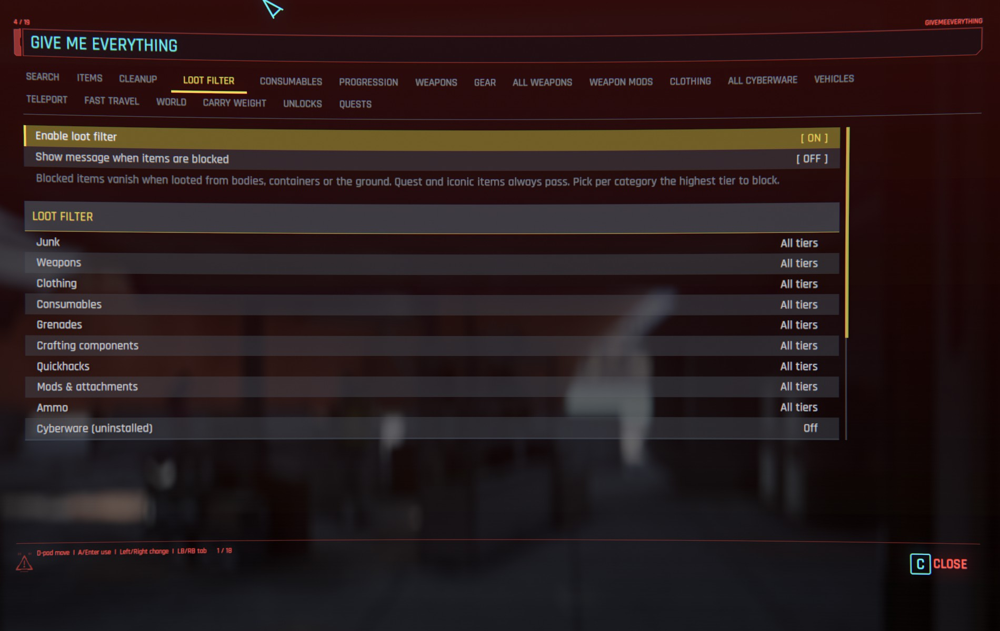
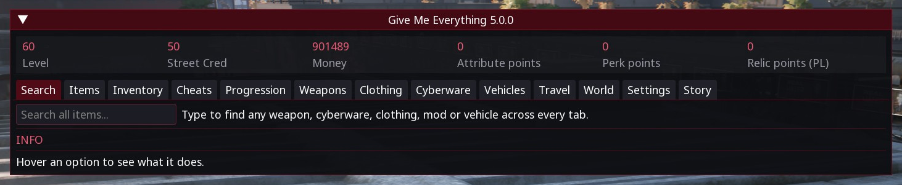
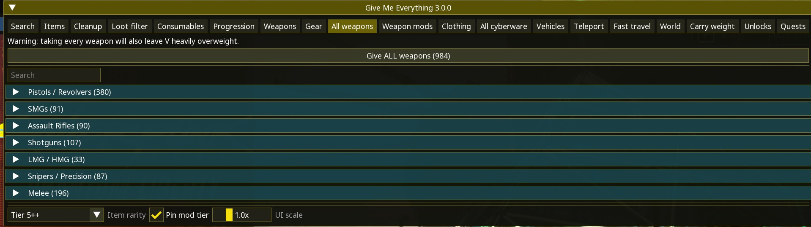
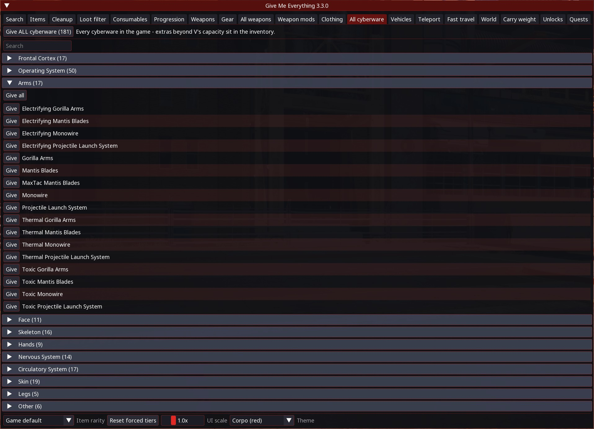
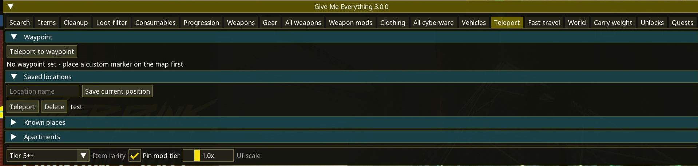
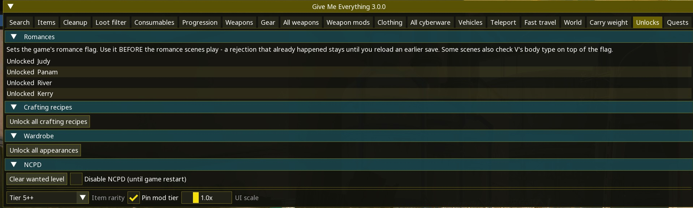
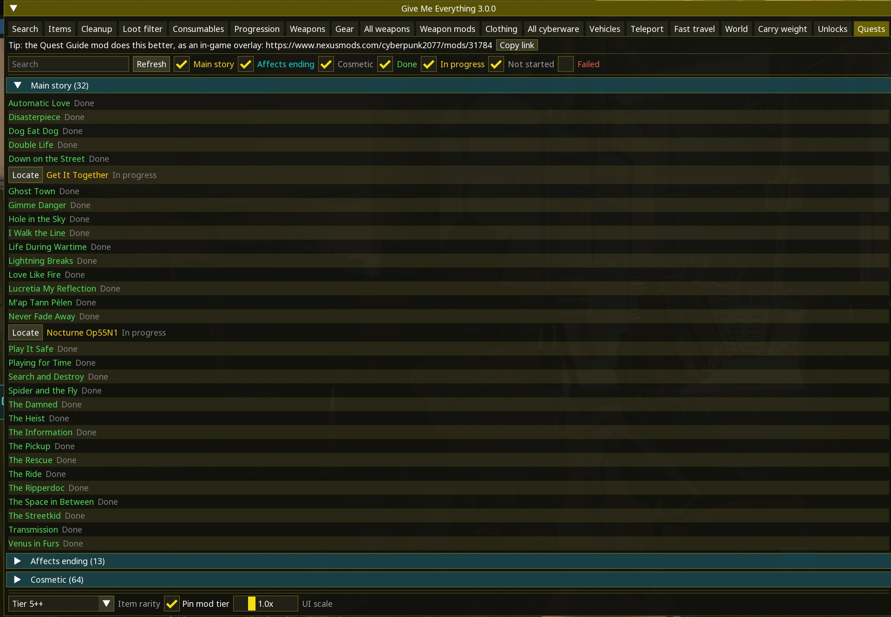

# GiveMeEverything

All-in-one cheat panel for CET: any item at any rarity, god mode, multipliers, teleport, fast travel, vehicles, quest journal and more.

## ✨ Features
- Native menu with full controller support (LB+Y), same tabs as the CET panel
- Any item, any rarity - 19 tabs
- Loot filter: block junk by category and tier
- Auto-loot: empty bodies and containers from a distance, markers included
- God mode, XP/damage multipliers, unlocks
- Teleport, fast travel, saved locations
- Live quest journal with one-click track
- Items from other mods are protected from cleanup and loot filter
- English & PT-BR

## 📸 Screenshots

## 📦 Install
Download on [Nexus Mods](https://www.nexusmods.com/cyberpunk2077/mods/31460). Extract into the game root folder (the one with `bin`, `archive`, `r6`) or install with Vortex / Mod Organizer 2.

Requires [Cyber Engine Tweaks](https://www.nexusmods.com/cyberpunk2077/mods/107) and [redscript](https://www.nexusmods.com/cyberpunk2077/mods/1511).

## 🔗 Links
- Mod page: https://www.nexusmods.com/cyberpunk2077/mods/31460
- All my mods: https://next.nexusmods.com/profile/opaaaaaaaaaaaa/mods
- Source & releases: https://github.com/nventatech/game-mods

## ☕ Support
If you like the mod: [PayPal](https://www.paypal.com/donate/?business=SR28XBBCYSPHE&no_recurring=0&item_name=Help+me+buy+a+coffee.&currency_code=USD)
