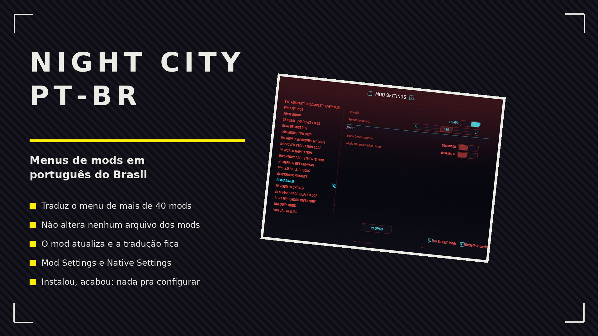

# Night City PT-BR

Deixa o menu de mais de 30 mods do Cyberpunk 2077 em português do Brasil, sem alterar nenhum arquivo dos mods traduzidos.

## ✨ O que faz
- Traduz o menu do Mod Settings: nome, descrição e valores de cada opção
- Traduz as abas do Native Settings, o menu "Mods" do jogo
- Traduz a tela do All Mod Settings, que antes mostrava a chave interna no lugar do texto
- Não substitui arquivo de nenhum mod, então os mods continuam recebendo update
- Frase nova de um update aparece em inglês até a próxima versão daqui; nada quebra

## 📦 Instalação
Requisitos: [Cyber Engine Tweaks](https://www.nexusmods.com/cyberpunk2077/mods/107), [ArchiveXL](https://www.nexusmods.com/cyberpunk2077/mods/4198), [RED4ext](https://www.nexusmods.com/cyberpunk2077/mods/2380) e [Mod Settings](https://www.nexusmods.com/cyberpunk2077/mods/4885).

Copie as pastas `archive` e `bin` do zip para a raiz do jogo. O idioma do texto do jogo precisa estar em português do Brasil.

## ❤️ Doação
[PayPal](https://www.paypal.com/donate/?business=SR28XBBCYSPHE&no_recurring=0&item_name=Help+me+buy+a+coffee.&currency_code=USD)
