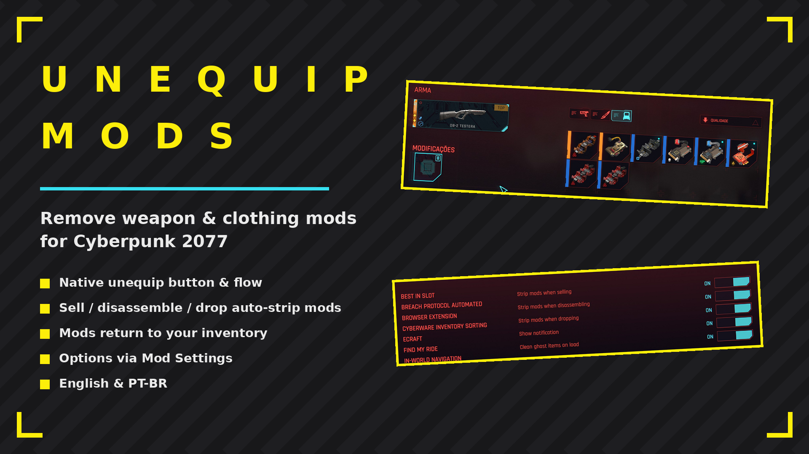
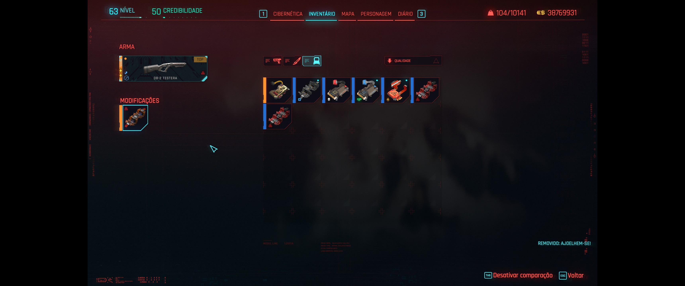
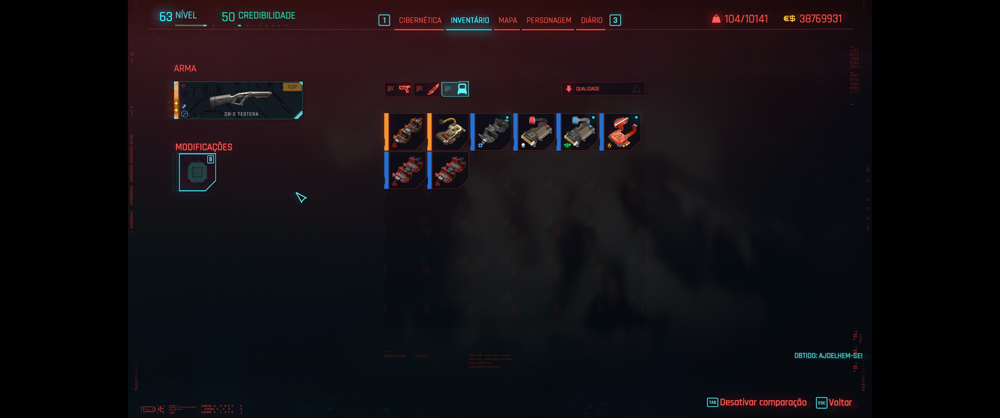
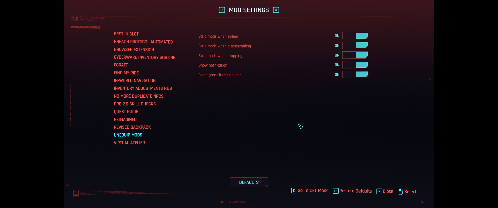

# UnequipMods

Unequip weapon and clothing mods back to your inventory instead of losing them. Native button and flow.

## ✨ Features
- Native unequip button & flow
- Mods return to your inventory
- Selling, disassembling and dropping auto-strip mods first
- Options in the Mod Settings menu (optional dependency)
- Nothing destroyed, no extra windows
- English & PT-BR, following the game language

## 📸 Screenshots

## 🌍 Translating
Texts live in `Localization.reds`. To add a language, copy a package class, translate the
strings and add a `case` in `GetPackage`. A translation can also ship as a separate mod:
register your own `ModLocalizationProvider` with the same keys.

## 📦 Install
Download on [Nexus Mods](https://www.nexusmods.com/cyberpunk2077/mods/31701). Extract into the game root folder (the one with `bin`, `archive`, `r6`) or install with Vortex / Mod Organizer 2.

## 🔗 Links
- Mod page: https://www.nexusmods.com/cyberpunk2077/mods/31701
- All my mods: https://next.nexusmods.com/profile/opaaaaaaaaaaaa/mods
- Source & releases: https://github.com/nventatech/game-mods

## ☕ Support
If you like the mod: [PayPal](https://www.paypal.com/donate/?business=SR28XBBCYSPHE&no_recurring=0&item_name=Help+me+buy+a+coffee.&currency_code=USD)
