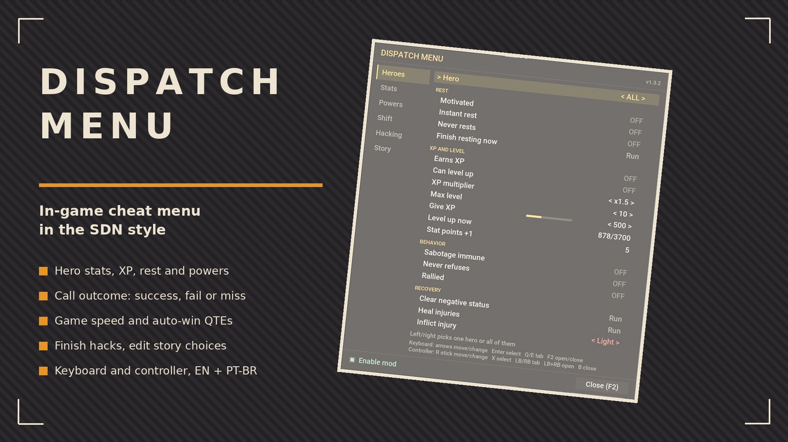

# Dispatch Menu

In-game cheat menu for Dispatch, styled like the SDN screens. Works on keyboard and controller, pauses the game while open. No trainer, no game files modified.

## ✨ Features
- **Heroes**: motivated, instant rest, never rests, XP on/off, XP multiplier, give XP, level up now, stat points, max level, sabotage immune, never refuses, rally, clear negative status, heal injuries, inflict injury. One hero or all at once.
- **Stats**: combat, mobility, vigor, charisma, intellect with +/- per hero, all to 10 or back to 1.
- **Powers**: learn or forget each power of a hero, or reveal the starting powers at once.
- **Shift**: game speed x1-x8 (back to x1 when you enter a shift or a hack; above x1 can break scripted calls), force the current call to success/fail/miss, reveal the stat requirements of every call, abort the call, auto sabotage on/off, end the shift.
- **Hacking**: extra life, no fail on time out, finish the hacking with success.
- **Story**: skip the current scene, skip to the next choice, auto-win QTEs, list of the game's story variables (hero/anti-hero, mentor, romance, flags) with editable flags and counters.
- **Enable mod** switch at the bottom of the menu turns every cheat off and back on.
- Toggles and the menu hotkey (`hotkey=F2`) are saved to `settings.txt` next to the mod and restored on the next launch.
- English and Brazilian Portuguese, picked from the game language.

## 🎮 Controls
- Open: `F2` or `LB+RB`. Close: `B`, `Esc` or `F2`.
- Move and change values: right stick or arrow keys. Select: `X` or `Enter`. Tabs: `LB`/`RB`, `LT`/`RT`, `Q`/`E`. Enable mod and Close sit below the last option.
- D-pad and left stick are eaten by the game UI, so the menu uses the right stick.

## 📦 Install
Main file (recommended): extract everything into `Dispatch\Dispatch\Binaries\Win64`. Includes UE4SS (experimental build) already configured for Dispatch (UE4SS 2.5.2 and 3.0.1 do not start on this game). Already run UE4SS? Extract the mod-only zip into `Win64\ue4ss\Mods` and add `DispatchMenu : 1` above `Keybinds` in `mods.txt`. Linux/Steam Deck: launch option `WINEDLLOVERRIDES="dwmapi=n,b" %command%`.

## 🔗 Links
- Mod page: https://www.nexusmods.com/dispatch/mods/37
- All my mods: https://next.nexusmods.com/profile/opaaaaaaaaaaaa/mods
- Source & releases: https://github.com/nventatech/game-mods
- Credits: [UE4SS](https://github.com/UE4SS-RE/RE-UE4SS) by the UE4SS-RE team (MIT, license included)

## ☕ Support
If you like the mod: [PayPal](https://www.paypal.com/donate/?business=SR28XBBCYSPHE&no_recurring=0&item_name=Help+me+buy+a+coffee.&currency_code=USD)
