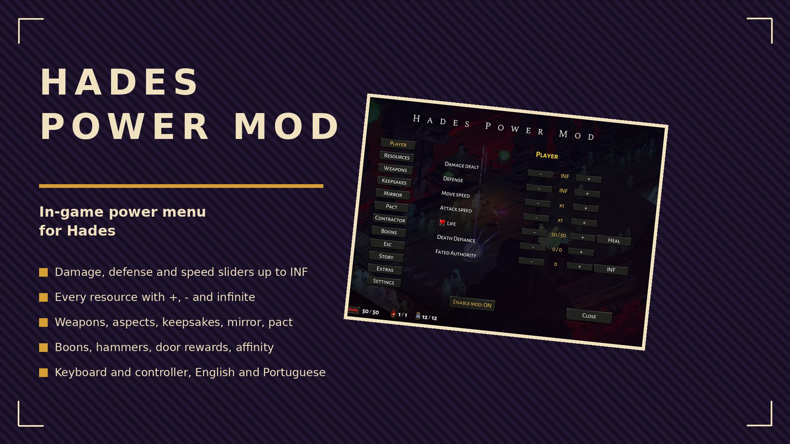

# Hades Power Mod

In-game power menu for Hades, drawn with the game's own screens. Press R and G together, change what you want, close it and keep playing. Keyboard and controller.

## ✨ Features
- **Player**: damage dealt and defense x1 to INF, move and attack speed x1 to x5, health, heal, Death Defiance, Fated Authority with INF.
- **Resources**: Obols, Darkness, Gemstones, Keys, Nectar, Titan Blood, Diamonds, Ambrosia, each with +, - and INF.
- **Weapons**: unlock or lock each Infernal Arm, reveal hidden aspects, aspect levels, equip from the House.
- **Keepsakes**: every keepsake and companion with level, unlock, max, equip; recharge the companion.
- **Mirror** and **Pact**: talent by talent, condition by condition, swap, max, reset.
- **Contractor**: every work one by one or all at once.
- **Boons**: any boon of any god at the rarity you pick, Pom up or down, remove, hammers and Chaos, minimum offered rarity.
- **Run**: clear room, reroll doors for free, set every door to a chosen reward.
- **Story**: affinity hearts per character. **Extras**: whole Codex, prophecies, fish.
- **Enable mod** switch turns every cheat off and back on. Sliders and INF switches are saved with the profile.
- English and Brazilian Portuguese from the game language, with an override in Settings.

## 🎮 Controls
- Open and close: R + G together (any pair of game controls in Settings, also on the controller). Close: Esc or B.
- Mouse or left stick to move, A to click, LB/RB switch tabs, `<` `>` change page.

## 📦 Install
Needs [Mod Importer](https://www.nexusmods.com/hades/mods/26) and [Mod Utility](https://www.nexusmods.com/hades/mods/27). Extract the zip into `Hades/Content/Mods` (you get `Content/Mods/HadesPowerMod/modfile.txt`), run `modimporter` from `Content`, start the game. Update or remove: change the folder and run `modimporter` again.

## 🔗 Links
- All my mods: https://next.nexusmods.com/profile/opaaaaaaaaaaaa/mods
- Source & releases: https://github.com/nventatech/game-mods

## ☕ Support
If you like the mod: [PayPal](https://www.paypal.com/donate/?business=SR28XBBCYSPHE&no_recurring=0&item_name=Help+me+buy+a+coffee.&currency_code=USD)
