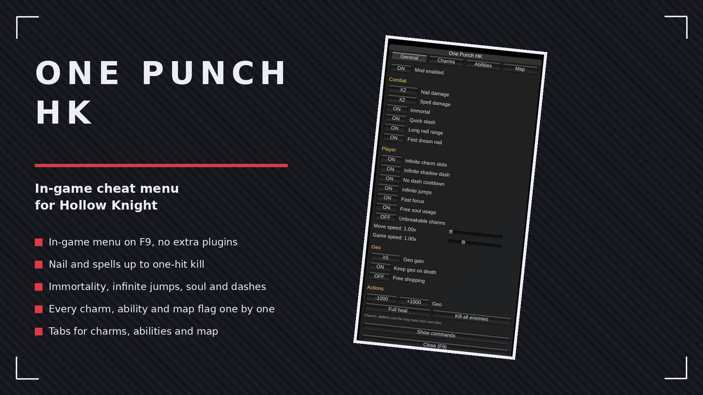
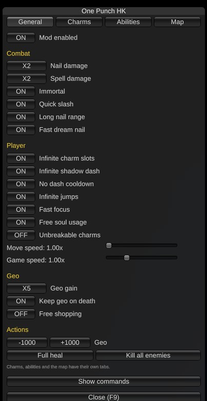
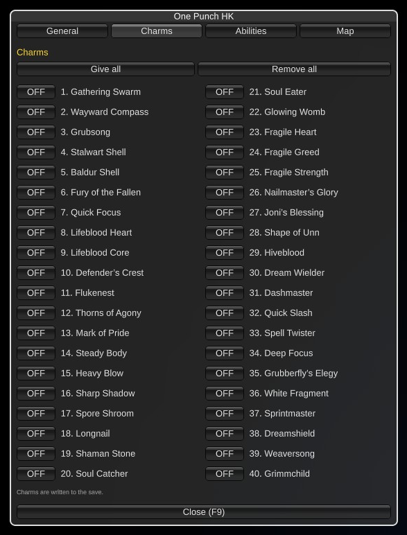
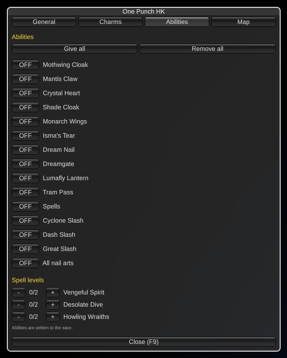
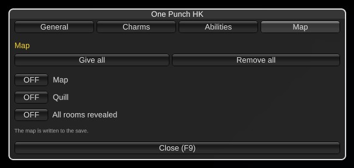

# One Punch HK

In-game cheat menu for Hollow Knight. Press F9, toggle what you want, no other plugin needed.

## ✨ Features
- In-game menu on F9, everything live
- Nail & spells up to one-hit kill
- Quick slash, long nail range, fast dream nail
- Immortality, infinite jumps & soul, unbreakable charms, no dash cooldown
- Move speed and game speed sliders
- Geo multipliers, keep geo on death, free shopping, give geo
- Full heal, kill all enemies
- Tabs for charms, abilities and map, every entry with its own switch

## 📸 Screenshots

## 🌍 Translating
Texts live in `I18n.cs`, one dictionary per language keyed by the English string. To add a
language, copy the dictionary, translate the values and return it from `PickTable`.

## 📦 Install
Extract into the game folder - the DLL lands in `BepInEx/plugins/`. Requires BepInEx 5.

## 🔗 Links
- Mod page: https://www.nexusmods.com/hollowknight/mods/193
- All my mods: https://next.nexusmods.com/profile/opaaaaaaaaaaaa/mods
- Source & releases: https://github.com/nventatech/game-mods

## ☕ Support
If you like the mod: [PayPal](https://www.paypal.com/donate/?business=SR28XBBCYSPHE&no_recurring=0&item_name=Help+me+buy+a+coffee.&currency_code=USD)
