# One Punch HK

In-game cheat menu for Hollow Knight. Press F9 (or L3+R3 on a gamepad), toggle what you want, no other plugin needed.

## ✨ Features
- In-game menu on F9, everything live
- Full gamepad control, no mouse needed (see Controls below)
- Damage sliders from x0.1 to x10 and one-hit kill: all hits, nail or spells, with 0.1 fine steps
- Tabs in a column on the left: Player, Combat, Charms, Economy, Abilities, Stags, Map, Grubs, Items, Teleport, Settings
- Quick slash, long nail range, fast dream nail
- Immortality, infinite jumps & soul, unbreakable charms, no dash cooldown
- Move speed and game speed sliders
- Geo multipliers, keep geo on death, free shopping, give geo
- Full heal, refill soul, kill all enemies (with confirmation)
- Save position, teleport back to it, return to the last bench
- Charm effects without owning, equipping or notches (Effect switch per charm)
- Change charms anywhere, no bench needed
- Every charm, ability, stag, map chart, grub and item with its own switch
- Teleport tab: every room in the game by area, with search
- Masks and soul vessels editors
- Key rebinding inside the menu and a scale slider for big screens

## 🎮 Controls
| Input | Action |
| --- | --- |
| F9 / L3+R3 | open and close the menu |
| Stick, d-pad or mouse | move between options |
| A | select |
| B | close |
| Left / right | adjust sliders and cycle modes |
| LB / RB | change tab |

## 📸 Screenshots
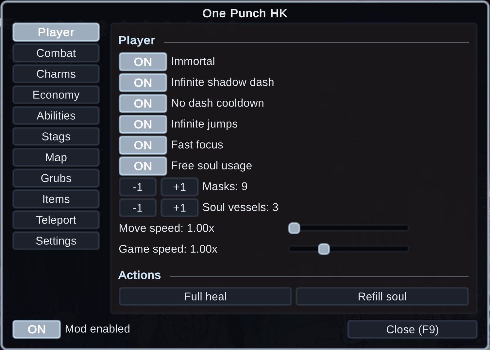
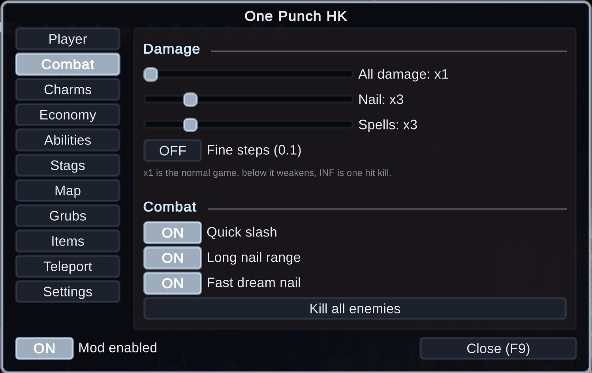
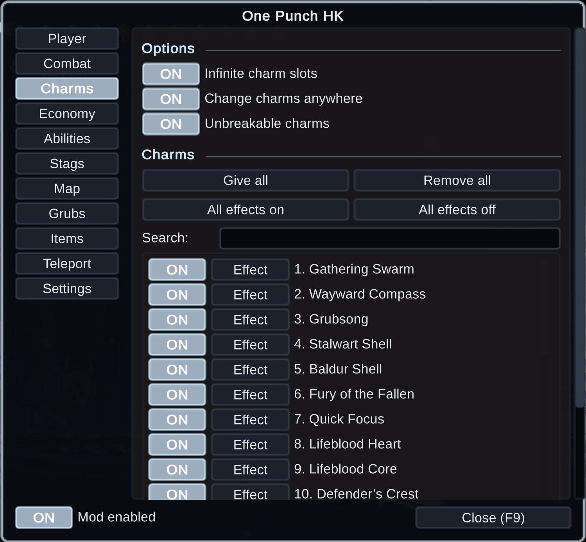
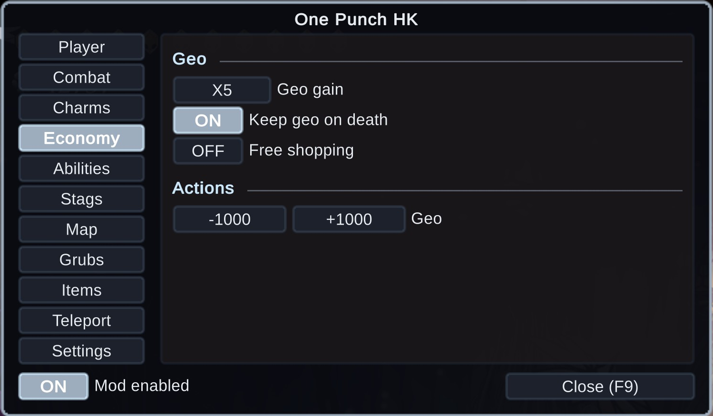
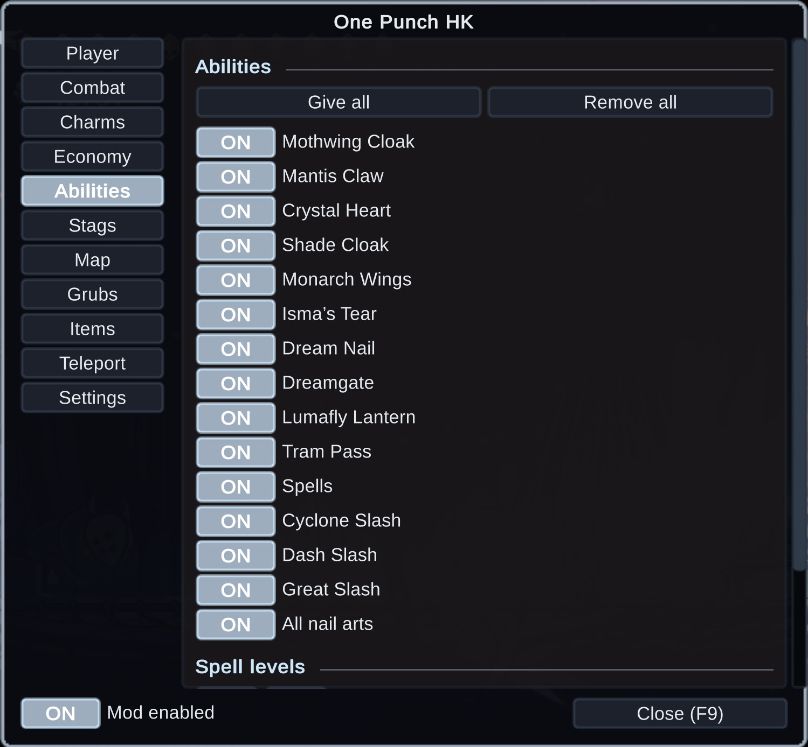
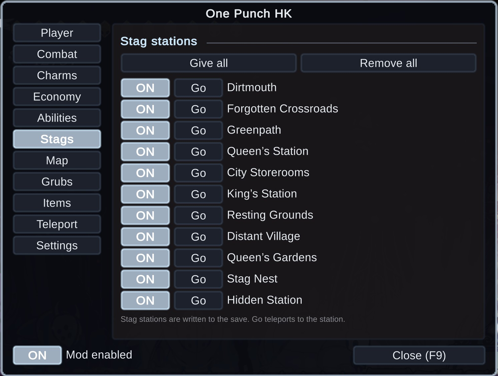
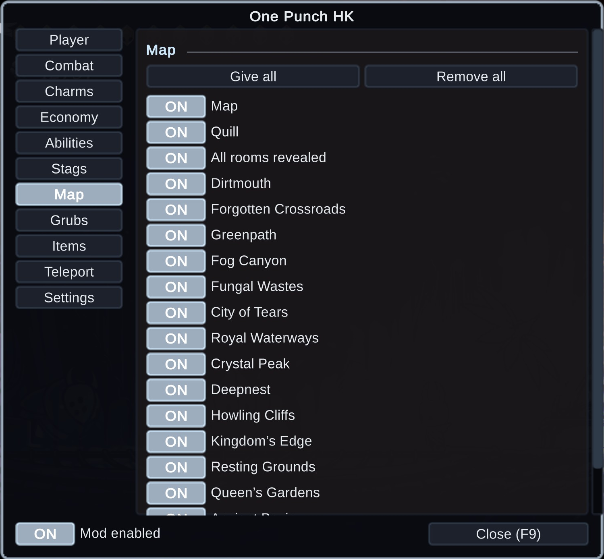
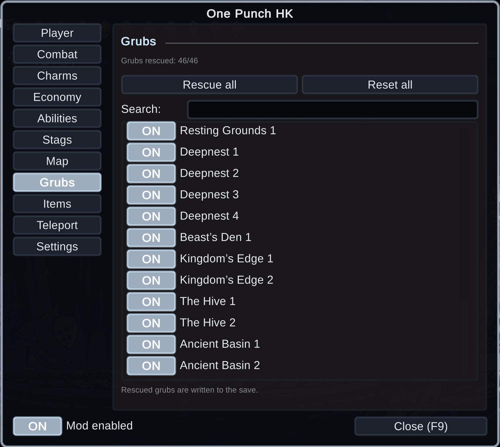
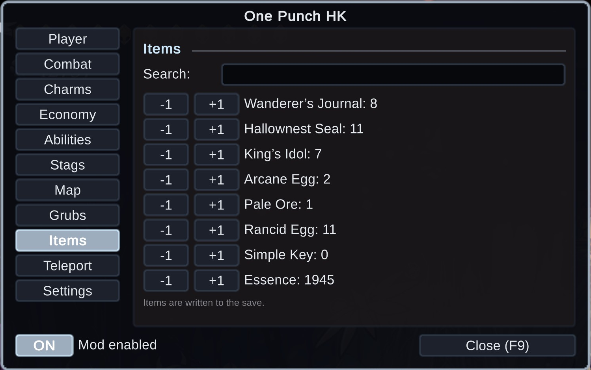
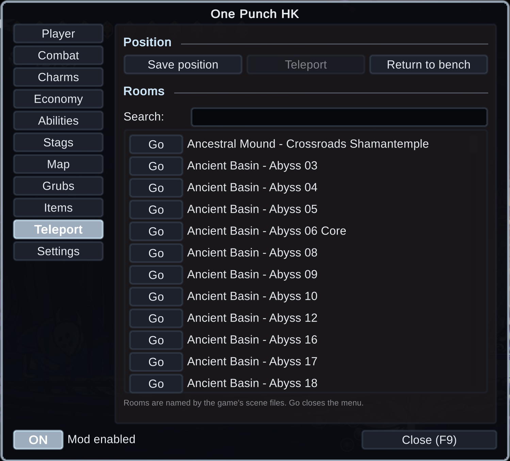
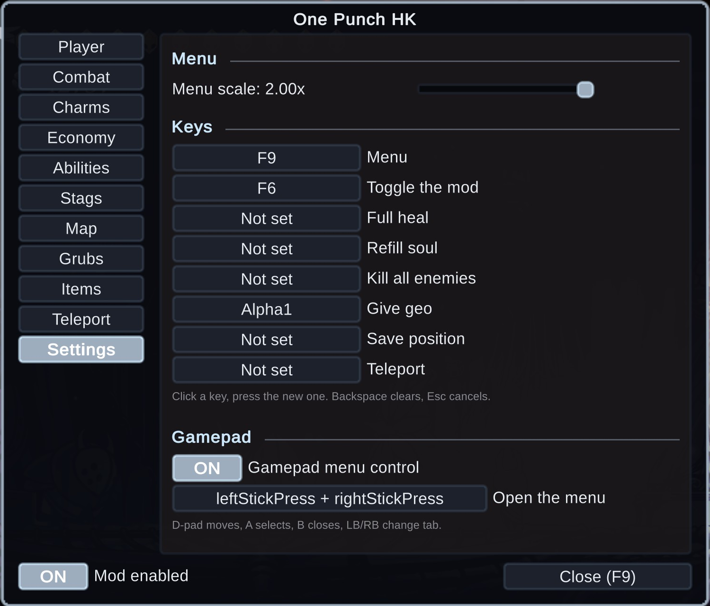

## 🌍 Translating
Texts live in `I18n.cs`, one dictionary per language keyed by the English string. To add a
language, copy the dictionary, translate the values and return it from `PickTable`.

## 📦 Install
Download on [Nexus Mods](https://www.nexusmods.com/hollowknight/mods/193). Extract into the game folder - the DLL lands in `BepInEx/plugins/`. Requires BepInEx 5.

## 🔗 Links
- Mod page: https://www.nexusmods.com/hollowknight/mods/193
- All my mods: https://next.nexusmods.com/profile/opaaaaaaaaaaaa/mods
- Source & releases: https://github.com/nventatech/game-mods

## ☕ Support
If you like the mod: [PayPal](https://www.paypal.com/donate/?business=SR28XBBCYSPHE&no_recurring=0&item_name=Help+me+buy+a+coffee.&currency_code=USD)
