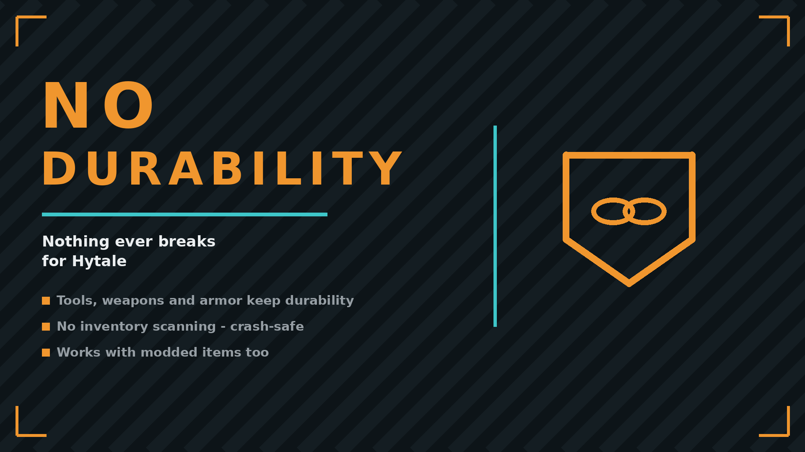

# NoDurability

Hytale server plugin. Items never lose durability — tools, weapons and armor stay intact forever.

## ✨ Features
- Durability loss disabled for every item, including modded ones
- No inventory scanning: work happens once at asset load, zero per-tick cost
- No config, no dependencies

## 📦 Install
Drop `NoDurability-x.y.z.jar` into your Mods folder:
- Windows: `%AppData%\Hytale\UserData\Mods`
- Linux: `~/.local/share/Hytale/UserData/Mods`

Singleplayer works out of the box; on multiplayer servers only the server needs it.

## 🔗 Links
- Mod page: https://www.curseforge.com/hytale/mods/nodurability
- All my mods: https://next.nexusmods.com/profile/opaaaaaaaaaaaa/mods
- Source & releases: https://github.com/nventatech/game-mods

## ☕ Support
If you like the mod: [PayPal](https://www.paypal.com/donate/?business=SR28XBBCYSPHE&no_recurring=0&item_name=Help+me+buy+a+coffee.&currency_code=USD)
