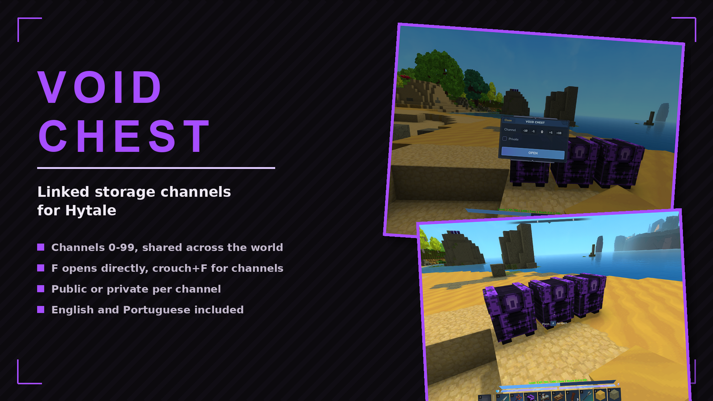
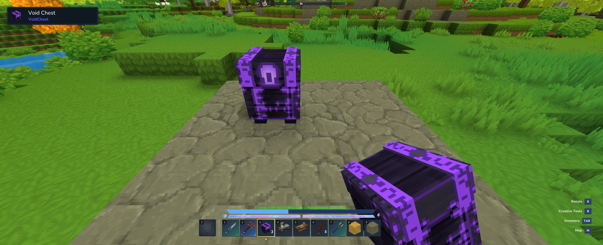
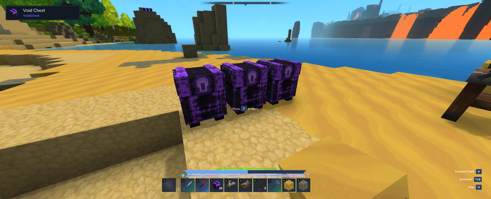
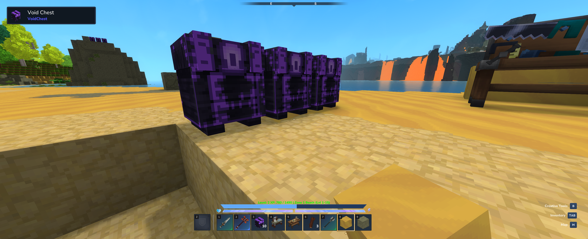
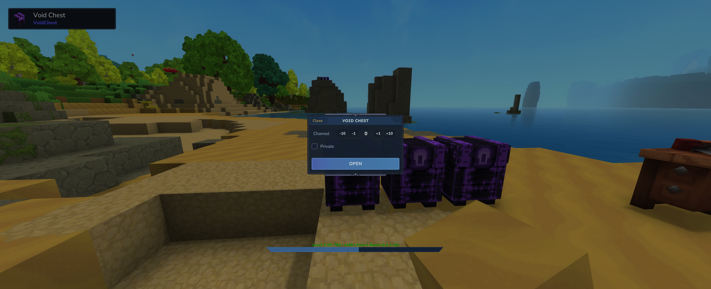
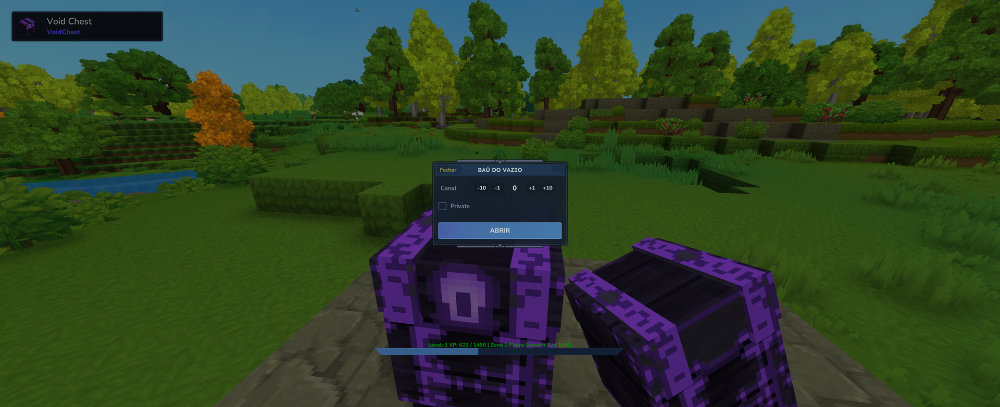

# VoidChest

Hytale server plugin. Craftable chest that links to a channel: every chest on the same
channel shares its contents, anywhere in the world.

## ✨ Features
- Chests on the same channel share contents anywhere in the world
- Channel menu: pick 0-99, toggle public/private
- F opens directly, crouch+F for the channel menu
- HUD info while the chest is open
- Recipe: 6 Deadwood Planks + 4 Iron Bar + 2 Void Essence, Furniture bench (memories level 3)

## 📸 Screenshots

## 🌍 Translating
Texts live in `resources/Server/Languages/<locale>/server.lang`. To add a language, copy the
`en-US` folder, rename it to the locale and translate the values. Command descriptions stay in
English: the server has no translation hook for them.

## 📦 Install
Drop `VoidChest-x.y.z.jar` into your Mods folder:
- Windows: `%AppData%\Hytale\UserData\Mods`
- Linux: `~/.local/share/Hytale/UserData/Mods`

Singleplayer works out of the box; on multiplayer servers only the server needs it.

## 🔗 Links
- Mod page: https://www.curseforge.com/hytale/mods/void-chest
- All my mods: https://next.nexusmods.com/profile/opaaaaaaaaaaaa/mods
- Source & releases: https://github.com/nventatech/game-mods

## ☕ Support
If you like the mod: [PayPal](https://www.paypal.com/donate/?business=SR28XBBCYSPHE&no_recurring=0&item_name=Help+me+buy+a+coffee.&currency_code=USD)
