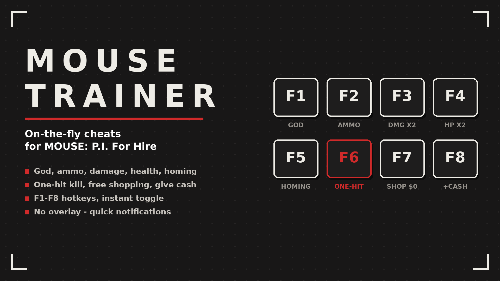

# MOUSE Trainer

Toggle God Mode, Infinite Ammo, Double Damage, Double Health and Homing Bullets on the fly with F1-F5. No permanent overlay, just a quick on-screen toast per toggle.

## ✨ Features
- F1 God Mode, F2 Infinite Ammo (both off by default)
- F3 Double Damage, F4 Double Health (both on by default)
- F5 Homing Bullets (off by default): locks every shot onto the enemy closest to your crosshair, respects line of sight, removes weapon spread while active
- F6 One-Hit Kill, F7 Free Shopping & upgrades (both off by default)
- F8 Give Cash (+5000 per press)
- Each cheat is independent; turning one off restores the original values
- No game files modified — safe to add or remove at any time

## 🌍 Translating
Texts live in `I18n.cs`, one dictionary per language keyed by the English string. To add a language, copy the dictionary, translate the values and return it from `PickTable`.

## 📦 Install
Requires [Patch for BepInEx MOUSE P.I. For Hire](https://www.nexusmods.com/mousepiforhire/mods/1) (BepInEx 5 x64). Download on [Nexus Mods](https://www.nexusmods.com/mousepiforhire/mods/23) and extract into the game folder — the DLL lands in `BepInEx/plugins/MouseTrainer.dll`.

## 🔗 Links
- Mod page: https://www.nexusmods.com/mousepiforhire/mods/23
- All my mods: https://next.nexusmods.com/profile/opaaaaaaaaaaaa/mods
- Source & releases: https://github.com/nventatech/game-mods

## ☕ Support
If you like the mod: [PayPal](https://www.paypal.com/donate/?business=SR28XBBCYSPHE&no_recurring=0&item_name=Help+me+buy+a+coffee.&currency_code=USD)
