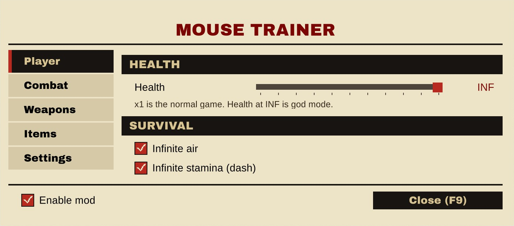
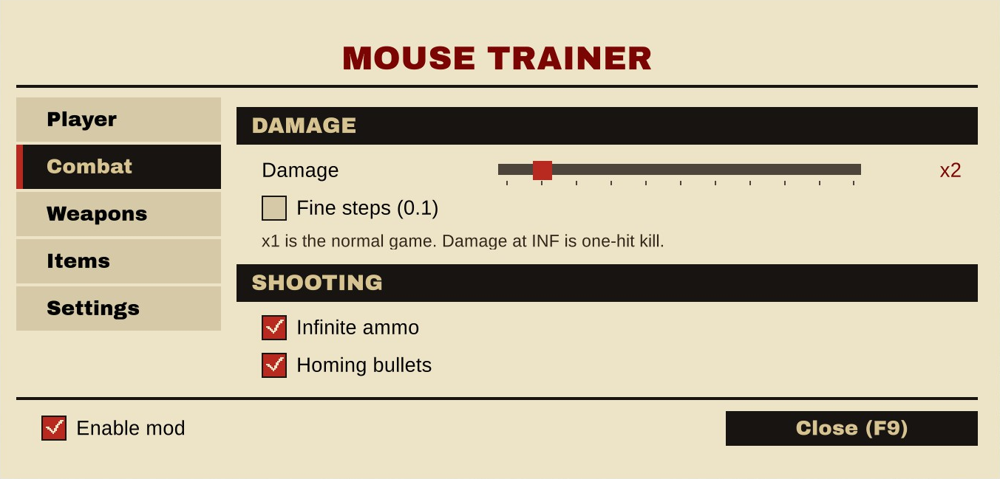
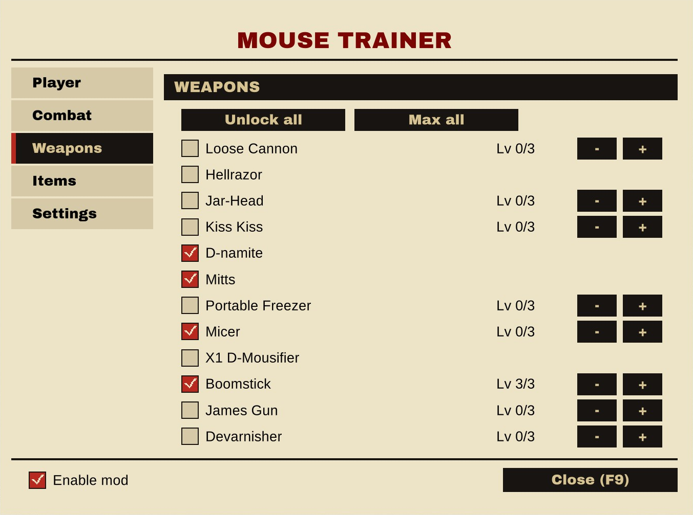
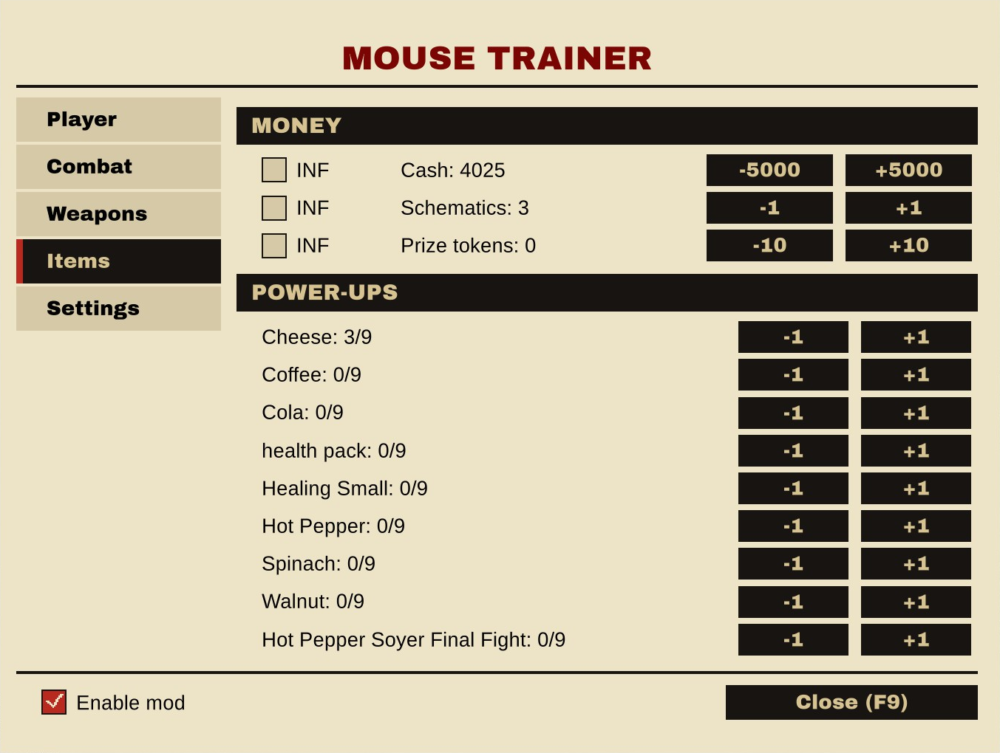
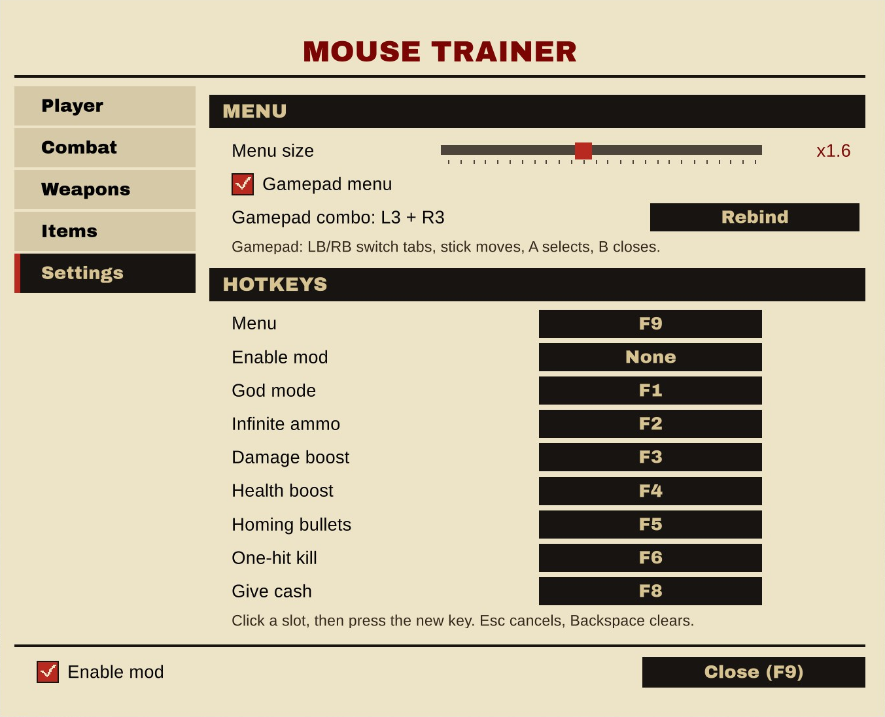

# MOUSE Trainer

In-game cheat menu for MOUSE: P.I. For Hire, in the game's own paper-and-ink look. Press F9 (or L3+R3 on a gamepad) for the menu, or use the F1-F8 hotkeys with an on-screen toast per toggle.

## ✨ Features
- In-game menu on F9 with the game's fonts, tabs for Player, Combat, Weapons, Items and Settings
- Full gamepad control, no mouse needed (see Controls below)
- Health and damage sliders from x1 to INF: INF is god mode on health and one-hit kill on damage
- Fine 0.1 steps for damage, down to x0.1
- Infinite ammo and homing bullets (locks every shot onto the enemy closest to your crosshair, respects line of sight, no spread)
- Infinite air and stamina
- Cash, schematics and prize tokens: add, remove or set to infinite
- Every weapon: own/lock and upgrade level 0-3, plus unlock all and max all
- Power-ups +1/-1
- Settings tab: menu size, gamepad on or off, gamepad combo and every hotkey rebindable
- Enable mod switch that turns every cheat off at once
- No game files modified, safe to add or remove at any time

## 🎮 Controls
| Input | Action |
| --- | --- |
| F9 / L3+R3 | open and close the menu |
| Stick or d-pad | move between options |
| LB / RB | switch tabs |
| A | select |
| B | close |
| Left / right | move the sliders |

## 📸 Screenshots

## 🌍 Translating
Texts live in `I18n.cs`, one dictionary per language keyed by the English string. To add a language, copy the dictionary, translate the values and return it from `PickTable`.

## 📦 Install
Requires [Patch for BepInEx MOUSE P.I. For Hire](https://www.nexusmods.com/mousepiforhire/mods/1) (BepInEx 5 x64). Download on [Nexus Mods](https://www.nexusmods.com/mousepiforhire/mods/23) and extract into the game folder, the DLL lands in `BepInEx/plugins/MouseTrainer.dll`.

## 🔗 Links
- Mod page: https://www.nexusmods.com/mousepiforhire/mods/23
- All my mods: https://next.nexusmods.com/profile/opaaaaaaaaaaaa/mods
- Source & releases: https://github.com/nventatech/game-mods

## ☕ Support
If you like the mod: [PayPal](https://www.paypal.com/donate/?business=SR28XBBCYSPHE&no_recurring=0&item_name=Help+me+buy+a+coffee.&currency_code=USD)
