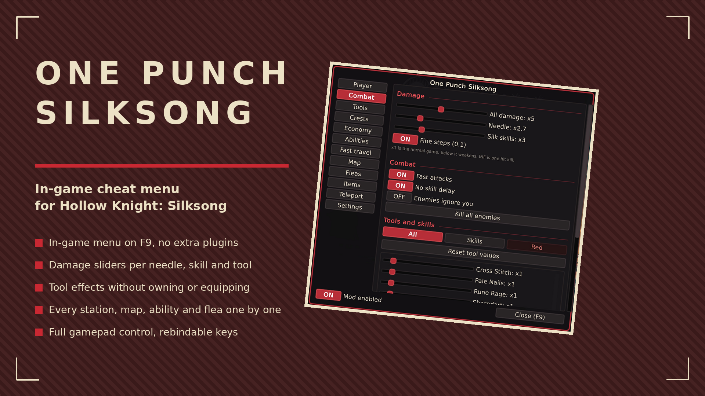
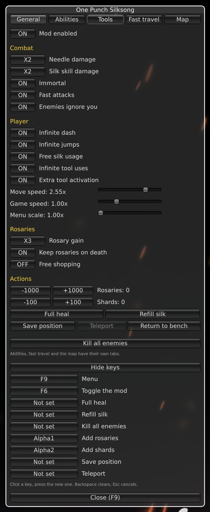
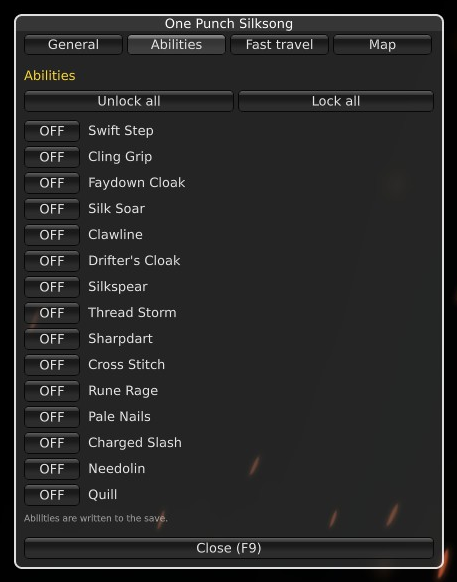
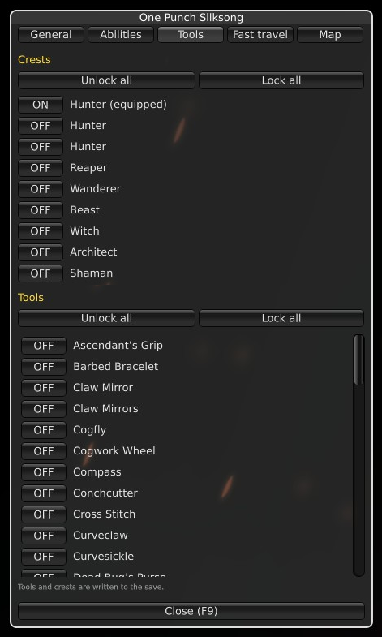
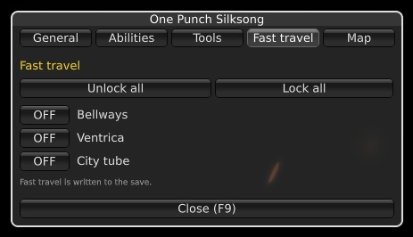
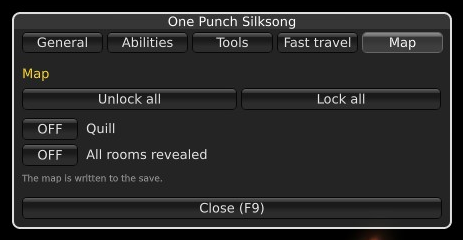

# One Punch Silksong

In-game cheat menu for Hollow Knight: Silksong. Press F9 (or L3+R3 on a gamepad), toggle what you want, no other plugin needed.

## ✨ Features
- In-game menu on F9, everything live
- Full gamepad control, no mouse needed (see Controls below)
- Needle & silk skills up to one-hit kill
- Fast attacks, no skill delay, infinite tool uses, extra tool slots
- Immortality, infinite jumps, dash & silk
- Move speed and game speed sliders
- Free shopping, give rosaries/shards/tool metal, rosary multipliers
- Change crest, skills and tools anywhere; crest slots without a Memory Locket
- Full heal, refill silk, kill all enemies
- Tabs for abilities, fast travel, map and fleas, every entry with its own switch

## 🎮 Controls
| Input | Action |
| --- | --- |
| F9 / L3+R3 | open and close the menu |
| D-pad or left stick | move between options |
| A | select |
| B | close |
| LB / RB | change tab |
| Left / right | adjust sliders and cycle modes |

Every key and the gamepad combo can be rebound in the menu itself ("Edit keys" in the General tab).

## 📸 Screenshots

## 🌍 Translating
Texts live in `I18n.cs`, one dictionary per language keyed by the English string. To add a
language, copy the dictionary, translate the values and return it from `PickTable`.

## 📦 Install
Download on [Nexus Mods](https://www.nexusmods.com/hollowknightsilksong/mods/1215). Extract into the game folder - the DLL lands in `BepInEx/plugins/`. Requires BepInEx 5.

## 🔗 Links
- Mod page: https://www.nexusmods.com/hollowknightsilksong/mods/1215
- All my mods: https://next.nexusmods.com/profile/opaaaaaaaaaaaa/mods
- Source & releases: https://github.com/nventatech/game-mods

## ☕ Support
If you like the mod: [PayPal](https://www.paypal.com/donate/?business=SR28XBBCYSPHE&no_recurring=0&item_name=Help+me+buy+a+coffee.&currency_code=USD)
