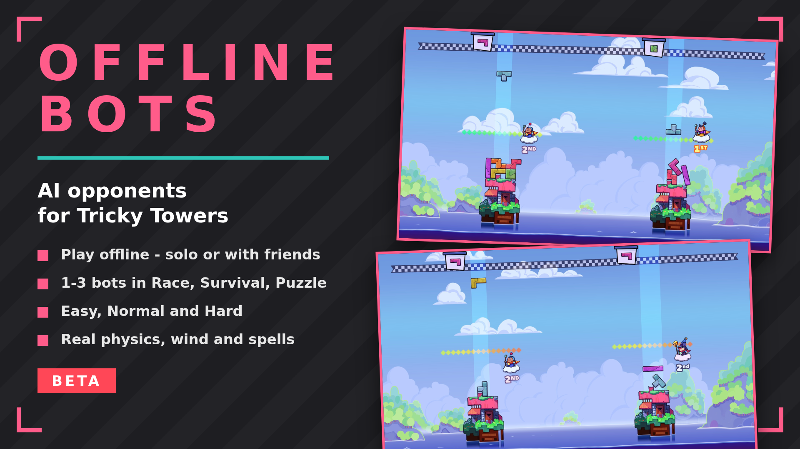

# Tricky Towers Offline Bots

Adds AI opponents to local multiplayer, so you can play Race, Survival and Puzzle offline — solo or with friends. Requested by the community since 2017, never implemented.

## ✨ Features
- Up to 3 bots in local multiplayer (BotCount 0-3)
- Play alone: with bots enabled, 1 player can start a local match
- Three difficulties: Easy, Normal, Hard
- Bots use the full game stack: wind, spells against them, win conditions
- Reserved slots show "BOT" on the player select screen

## 🌍 Translating
Texts live in `I18n.cs`, one dictionary per language keyed by the English string. To add a language, copy the dictionary, translate the values and return it from `PickTable`.

## ⚙️ Config
`BepInEx/config/com.opaaaaaaaaaaaa.trickytowers.offlinebots.cfg`
- `BotCount` — number of bots (default 1, 0 disables)
- `Difficulty` — Easy / Normal / Hard

## 📦 Install
1. Install BepInEx 5 x86 in the game folder (game is 32-bit)
2. Drop `TrickyTowersOfflineBots.dll` into `BepInEx/plugins`
3. Linux/Proton: set launch options `WINEDLLOVERRIDES="winhttp=n,b" %command%`

## 🔗 Links
- Mod page: https://www.nexusmods.com/trickytowers/mods/7
- All my mods: https://next.nexusmods.com/profile/opaaaaaaaaaaaa/mods
- Source & releases: https://github.com/nventatech/game-mods

## ☕ Support
If you like the mod: [PayPal](https://www.paypal.com/donate/?business=SR28XBBCYSPHE&no_recurring=0&item_name=Help+me+buy+a+coffee.&currency_code=USD)
